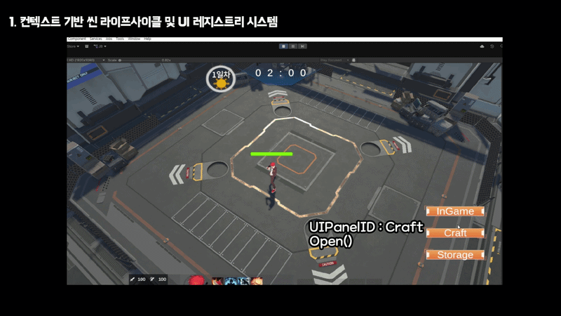
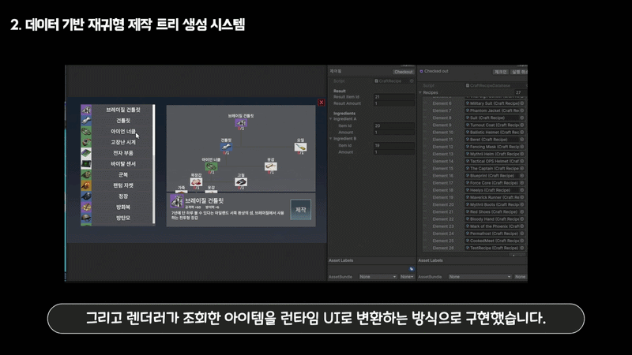
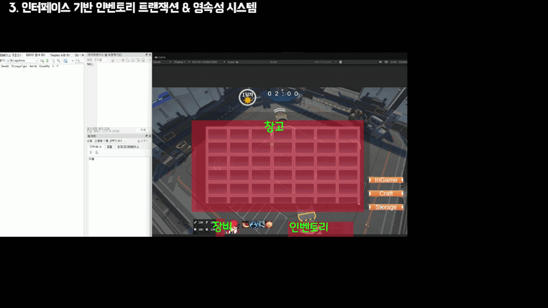
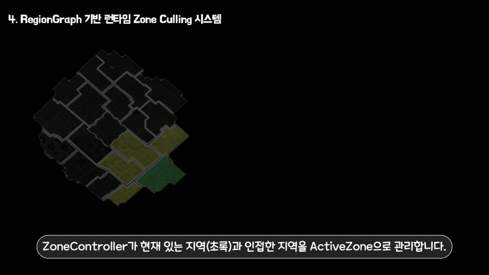
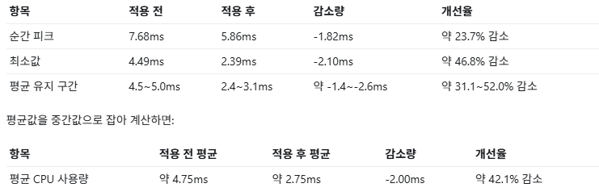

# Escape From Eternal Return Code Map

Unity 기반 생존 액션 RPG 프로젝트 **Escape From Eternal Return**에서 제가 담당한 런타임 시스템 구조를 정리한 포트폴리오용 Code Map입니다.

이 저장소는 전체 Unity 프로젝트를 공개하기보다, 제가 설계하고 구현한 **씬 라이프사이클, UI 레지스트리, 제작 트리, 아이템 컨테이너, SQLite 저장/로드, RegionGraph 기반 Zone Culling** 구조를 중심으로 설명합니다.

- [Interactive GitHub Pages](https://sj97p.github.io/EscapeFromEternalReturn-CodeMap/)
- [Architecture Overview](docs/architecture.md)
- [Class Diagram](docs/class-diagram.md)
- [Source Snapshot](src/Assets/00_Scripts)

## Project Summary

| Item | Description |
|---|---|
| Project | Escape From Eternal Return |
| Engine / Language | Unity / C# |
| Team | 3인 팀 프로젝트 |
| My Focus | Runtime Architecture, Scene/UI Flow, Inventory Transaction, SQLite Persistence, Region Culling |
| Portfolio Goal | 기능 나열보다 설계 의도, 구조적 고민, 결과 증거를 보여주는 것 |

## My Role

이번 프로젝트에서 저는 개별 기능보다 **기능들이 서로 안정적으로 연결되는 구조**를 만드는 데 집중했습니다.

- 모든 씬이 공통 `SceneController` 라이프사이클을 따르도록 설계
- `GameSceneManager`와 `SceneEnterContext`로 씬 전환과 데이터 전달 중앙화
- `UIPanelId` 기반 UI 레지스트리로 패널 Open/Close/Toggle 규격 통일
- `CraftTreeBuilder` 기반 재귀 제작 트리 생성 구조 구현
- 인벤토리, 창고, 장비창, 루팅창을 `IItemContainer`와 Adapter로 통합
- `UIItemMoveManager`로 이동, 병합, 스왑, 장비 검증, 자동 루팅 흐름 중앙 처리
- 런타임 `Storage`와 저장용 `StorageData`를 분리하고 SQLite Repository로 저장/로드 처리
- `RegionGraph`, `PlayerRegionTracker`, `ZoneController` 기반 Zone Culling 구조 구현

## Visual Evidence

### 1. Scene Lifecycle

씬 전환 흐름을 `Exit -> LoadSceneAsync -> Initialize(context) -> Enter` 순서로 통일해, 씬이 늘어나도 동일한 진입/종료 규칙을 유지하도록 구성했습니다.

### 2. UIPanel Registry

각 UI 버튼은 직접 패널을 참조하지 않고 `UIPanelId`만 전달하며, `NewUIManager`가 공통 `Open`, `Close`, `Toggle` 흐름으로 패널 상태를 제어합니다.

### 3. Recursive Crafting Tree

레시피 데이터를 기반으로 `CraftTreeBuilder`가 재귀 제작 트리를 생성하고, UI는 생성된 `CraftTreeNode` 구조를 렌더링하는 역할만 담당하도록 분리했습니다.

### 4. Item Container Transaction

서로 다른 저장소를 Adapter로 공통 컨테이너 규격에 맞추고, 이동 요청은 `UIItemMoveManager`에서 검증 후 Commit되도록 구성해 데이터 무결성을 우선했습니다.

### 5. RegionGraph Zone Culling

`PlayerRegionTracker`가 현재 Region을 감지하면, `ZoneController`가 `RegionGraph`를 기준으로 현재 지역과 인접 지역만 ActiveZone으로 유지합니다.

### 6. CPU Optimization Result

Zone Culling 적용 후 평균 CPU 사용량은 약 **4.75ms에서 2.75ms**로 감소했으며, 평균 기준 약 **42.1% 개선**을 확인했습니다.

## Core Systems

| System | Design Intent | Result |
|---|---|---|
| Scene Lifecycle & UI Registry | 씬 전환과 UI 호출 흐름을 씬/패널마다 흩어지지 않게 중앙화 | `SceneController`, `GameSceneManager`, `UIPanelId`, `NewUIManager` |
| Recursive Crafting Tree | UI는 출력만 담당하고, 제작 구조는 데이터 기반 재귀 트리로 처리 | `CraftTreeBuilder`, `CraftTreeNode`, `CraftingService` |
| Item Container Transaction | 인벤토리, 창고, 장비창, 루팅창의 공통 슬롯 조작 규격 정의 | `IItemContainer`, Adapter, `UIItemMoveManager` |
| SQLite Persistence | 런타임 슬롯 모델과 저장 DTO를 분리해 세이브 슬롯별 저장/로드 처리 | `Storage`, `StorageData`, `StorageRepository`, `DBLoader` |
| RegionGraph Zone Culling | 현재 지역과 인접 지역만 활성화해 보이지 않는 지역의 비용 감소 | `PlayerRegionTracker`, `RegionGraph`, `ZoneController` |
| Zone State API | 지역 기반 협업 기능이 붙을 수 있는 상태 API와 이벤트 확장 지점 제공 | `SetZoneState`, `SetZonesState`, `OnZoneStateChanged` |

## Design Notes

### Item Container

기존 인벤토리 구조는 인벤토리 하나의 동작에 강하게 맞춰져 있어 창고, 장비창, 루팅창, 제작대까지 확장하기 어려웠습니다.  
서로 다른 저장소라도 “슬롯에서 아이템을 읽고, 쓰고, 비우고, 갱신한다”는 공통 흐름은 같다고 판단했고, 이를 `IItemContainer`와 Adapter 구조로 통합했습니다.

한계도 있었습니다. 현재 이동 정책과 우선순위가 `UIItemMoveManager`에 집중되어 있어, 다음 개선에서는 이동 정책을 별도 Policy 객체로 분리하고 Undo/rollback 구조를 강화할 수 있습니다.

### Crafting

재료가 다시 제작 아이템일 수 있는 구조였기 때문에 재귀 탐색이 필요했습니다.  
`CraftTreeBuilder`는 레시피를 탐색해 트리 축을 만들고, `CraftTreeRenderer`는 UI 출력만 담당하도록 분리했습니다.

레시피는 직접 관리하는 데이터였기 때문에 순환 레시피 방지나 중복 재료 캐싱은 구현하지 않았습니다. 이후 데이터 규모가 커지거나 외부 편집이 가능해진다면 검증 로직을 추가할 수 있습니다.

### Zone Culling

맵과 오브젝트 수가 많고 몬스터와 상자 스폰도 존재했기 때문에, 플레이어가 보지 않는 지역까지 항상 활성화하는 구조는 피하고자 했습니다.  
`RegionGraph`를 데이터 기반으로 관리하고, 현재 지역과 인접 지역만 활성화하는 방식으로 Update 비용을 줄였습니다.

`OnZoneStateChanged` 이벤트는 확장 지점으로 제공했지만, 현재 코드맵 스냅샷 기준으로 외부 클래스가 직접 구독한 코드는 확인되지 않습니다. 따라서 포트폴리오에서는 “구독 가능한 API를 제공했다”로 표현합니다.

## Technical Stack / Patterns

| Topic | Applied In | Note |
|---|---|---|
| Adapter Pattern | `InventoryContainerAdapter`, `StorageContainerAdapter`, `TargetInventoryContainerAdapter`, `EquipmentAdapter` | 서로 다른 UI/데이터 모델을 `IItemContainer`로 통일 |
| Mediator / Facade | `UIItemMoveManager` | 컨테이너 간 이동, 병합, 스왑, 장비 검증을 중앙 처리 |
| Repository Pattern | `StorageRepository`, `GameRepositories` | SQLite 접근을 Repository로 분리 |
| DTO Mapping | `Storage.ExportToStorageData`, `StorageData` | 런타임 모델과 저장 모델 분리 |
| Registry | `NewUIManager`, `UIPanelId` | UI 패널을 ID 기반으로 등록/조회/제어 |
| Template Method 성격 | `SceneController` | 씬별 공통 라이프사이클을 상속 구조로 통일 |
| Graph-based Culling | `RegionGraph`, `ZoneController` | 현재 지역 + 인접 지역만 활성화 |
| Event-driven Extension Point | `OnZoneStateChanged` | 외부 지역 기능이 연결될 수 있는 이벤트 API 제공 |

## Key Class Pages

- [SceneController](docs/classes/SceneController.md)
- [GameSceneManager](docs/classes/GameSceneManager.md)
- [NewUIManager](docs/classes/NewUIManager.md)
- [CraftTreeBuilder](docs/classes/CraftTreeBuilder.md)
- [CraftingService](docs/classes/CraftingService.md)
- [IItemContainer](docs/classes/IItemContainer.md)
- [UIItemMoveManager](docs/classes/UIItemMoveManager.md)
- [Storage](docs/classes/Storage.md)
- [StorageRepository](docs/classes/StorageRepository.md)
- [ZoneController](docs/classes/ZoneController.md)
- [RegionGraph](docs/classes/RegionGraph.md)

## Reading Guide

1. 빠르게 결과를 보고 싶다면 README의 Visual Evidence를 먼저 확인합니다.
2. 구조 흐름을 보고 싶다면 [Interactive GitHub Pages](https://sj97p.github.io/EscapeFromEternalReturn-CodeMap/)에서 UML 노드를 클릭합니다.
3. 설계 의도와 세부 구현을 함께 보고 싶다면 GitHub Pages의 `설계 의도`, `고려한 문제와 선택`, `최종 구조`, `Evidence`, `Code Preview`를 순서대로 확인합니다.
