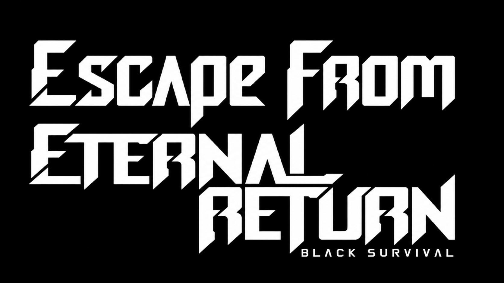
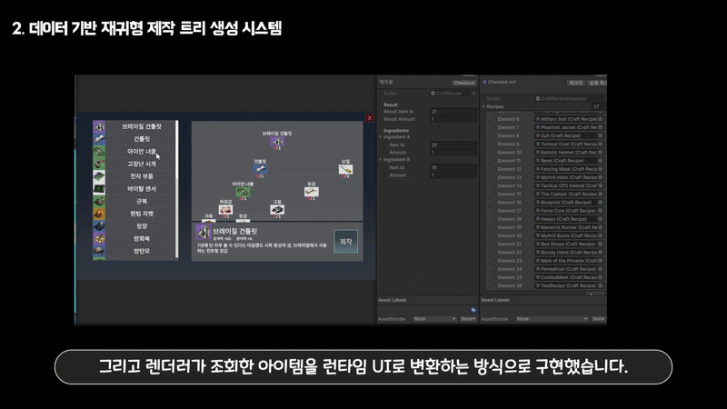
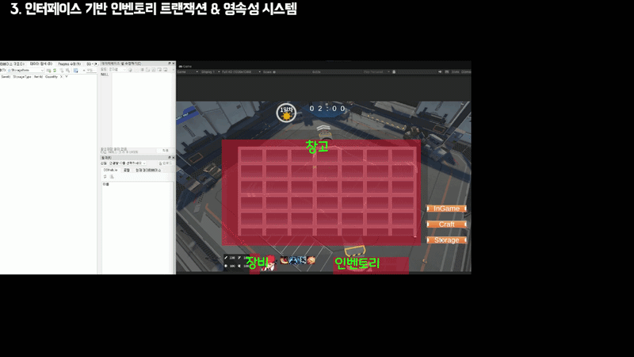
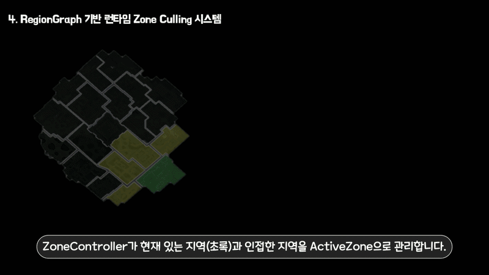
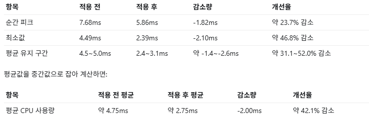

# Escape From Eternal Return Code Map



**Escape From Eternal Return**은 이터널 리턴의 전투 감각에 익스트랙션 장르의 생존과 회수 경험을 더해 본 Unity 기반 싱글 플레이 생존 액션 RPG입니다.

플레이어는 무작위 시작 지점에서 상자와 몬스터를 탐색하고, QWER 스킬과 기본 공격으로 싸우며 전리품을 모읍니다. 시간이 지나면 금지구역이 늘어나고, 결국 보스가 있는 연구소 쪽으로 동선이 모입니다. 살아서 탈출하면 파밍한 아이템을 다음 탐험을 위한 장비와 재료로 남길 수 있지만, 죽으면 입고 있던 장비와 이번 탐험에서 얻은 아이템을 모두 잃습니다.

이 프로젝트에서 제가 가장 오래 고민한 것은 전투 자체보다도, 위험을 감수해 들고 돌아온 아이템이 다음 탐험의 강함으로 자연스럽게 이어지는 흐름이었습니다. 아이템은 화면 속 숫자가 아니라 플레이어가 위험을 감수해 얻은 재산이라고 생각했습니다. 그래서 창고·장비·제작을 각각의 UI 기능으로 붙이기보다, 전리품을 보관하고 정리하고 목표 장비로 바꾸는 하나의 흐름으로 설계했습니다.

## 프로젝트 개요

- **프로젝트명:** Escape From Eternal Return
- **개발 기간:** 2026.04.17 ~ 2026.05.26
- **팀 구성:** 3인 팀 프로젝트
- **역할:** 팀장 · 전체 플레이 흐름 및 시스템 요구사항 설계 · 클라이언트 프로그래밍
- **기술 스택:** Unity 6 · C# · ScriptableObject · SQLite · Git
- **핵심 구현:** 재귀 기반 제작 트리 · Adapter 패턴 기반 아이템 컨테이너 통합 · SQLite 저장·복원 · RegionGraph 기반 Zone 활성화 최적화

저는 팀장으로서 게임의 핵심 흐름과 기능별 통과 기준을 잡고, 실제 플레이를 반복하며 결과가 의도와 다르면 피드백을 정리했습니다. 캐릭터와 몬스터의 세부 구현은 팀원과 분담했지만, 전투·보스 페이즈·금지구역·파밍·탈출이 어떤 경험으로 이어져야 하는지는 전체 흐름에서 함께 설계했습니다.

[](https://sj97p.github.io/EscapeFromEternalReturn-CodeMap/)

> 위 버튼을 누르면 제가 담당한 전체 시스템의 다이어그램과 공개 가능한 코드 전문을 정리한 인터랙티브 코드맵으로 이동합니다.

## 빠르게 보고 싶다면

- **창고 추가가 왜 큰 리팩터링이 되었는지**: [저장공간 규칙](#1-전리품을-다음-탐험으로-이어-주는-저장공간-규칙)
- **제작 목표를 어떻게 보여 줬는지**: [제작 트리](#2-목표-아이템을-한-번에-바라보게-한-제작-트리)
- **Zone 활성화와 CPU 비교**: [Region 기반 Zone](#3-불필요한-활성-상태를-줄인-region-기반-zone)
- **전체 구조와 공개 코드**: [인터랙티브 코드맵](https://sj97p.github.io/EscapeFromEternalReturn-CodeMap/)

## 이 코드맵에서 보고 싶은 것

이 저장소는 Unity 프로젝트 전체를 공개하기 위한 저장소가 아닙니다. 창고 하나를 추가하려 할 때 기존 인벤토리·장비·루팅 코드가 왜 함께 흔들렸는지, 그 상태에서 어떤 규칙을 다시 세웠는지, 그리고 실제 코드가 그 판단을 어떻게 담고 있는지를 남기기 위해 만들었습니다.

### 1. 전리품을 다음 탐험으로 이어 주는 저장공간 규칙

창고를 추가하려 했을 때 기존 인벤토리·장비·루팅 구조는 서로를 직접 참조하고 있었습니다. 기능 하나를 바꾸려 해도 여러 클래스를 함께 따라가야 했고, 퀵무브나 장비 교체처럼 여러 저장공간을 오가는 기능을 붙일수록 수정 범위가 넓어졌습니다.

저는 저장공간의 화면 모양이 아니라, 아이템을 **읽고 · 검증하고 · 옮기고 · 비우고 · 화면을 갱신하는 공통 규칙**을 먼저 분리하기로 했습니다. 인벤토리, 창고, 루팅, 장비창은 모두 `IItemContainer`로 다루고, 각 컨테이너의 크기와 장비 제한 같은 차이는 Adapter가 맡도록 구성했습니다. 이동 요청은 `UIItemMoveManager`가 모아 검증·이동·스왑·UI 갱신을 처리합니다.

```text
기존
인벤토리 / 장비 / 루팅이 서로를 직접 참조
        ↓
문제
창고·퀵무브·장비 교체를 붙일 때 수정 지점이 계속 늘어남
        ↓
판단
저장공간의 종류가 아니라 아이템 이동의 공통 규칙을 분리
        ↓
구현
IItemContainer + Container Adapter + UIItemMoveManager
```

퀵무브는 단순히 빈칸을 찾는 동작이 아니었습니다. 루팅창이 열려 있으면 인벤토리와 루팅창을 먼저 오가고, 창고가 열려 있으면 창고를 우선하며, 둘 다 닫혀 있을 때 장비 가능한 아이템만 장비창으로 보냅니다. 장비창은 투구·액세서리·갑옷·무기·신발처럼 부위가 정해져 있으므로, 이동 전에 대상 슬롯과 아이템 타입을 함께 검증합니다. 이동과 교체는 검증 이후에 처리하고, 중간 기록에 실패하면 원래 슬롯으로 되돌리는 흐름도 두었습니다.

> 이 구조 덕분에 인벤토리·창고·루팅·장비 사이의 CRUD와 장비 교체를 같은 이동 흐름으로 다룰 수 있었습니다. 다음에는 목적지 우선순위 자체를 별도 Policy 객체로 분리하고, 스택 병합과 이동 실패까지 포함한 더 명확한 트랜잭션 경계를 만들고 싶습니다.

### 2. 목표 아이템을 한 번에 바라보게 한 제작 트리

제작은 운 좋게 얻은 재료를 단순 소비하는 기능이 아니라, “이번에는 무엇을 더 챙겨 나와야 하는가”를 정하게 하는 목표였습니다. 상위 장비 하나를 클릭했을 때 최하위 재료까지 이어지는 관계를 보여주면, 플레이어는 이미 가진 아이템과 아직 필요한 아이템을 함께 점검할 수 있습니다.

여기서 중요하게 본 것은 조회 도중 화면을 조금씩 붙이는 방식보다, **완성된 재료 관계를 먼저 만들고 한 번에 보여 주는 것**이었습니다. 기다리는 시간 자체보다 정보가 완성되지 않은 채 화면이 갱신되는 경험이 더 답답할 수 있다고 생각했습니다. 그래서 `CraftTreeBuilder`가 ScriptableObject 레시피를 바탕으로 재귀 트리를 먼저 만들고, `CraftTreeRenderer`가 완성된 노드만 출력하게 나눴습니다.

```text
상위 아이템 선택
        ↓
CraftTreeBuilder가 재료 A/B를 재귀로 탐색
        ↓
최하위 재료까지 포함한 CraftTreeNode 완성
        ↓
CraftTreeRenderer가 보유 수량과 함께 출력
```

레시피는 결과 아이템과 재료 두 개를 가진 `CraftRecipe` ScriptableObject로 관리합니다. 트리는 최하위 재료까지 보여주지만, 실제 제작은 선택한 아이템의 바로 아래 재료 두 개부터 단계적으로 진행합니다. `CraftingService`는 인벤토리와 창고의 수량을 합산해 재료를 확인·차감하고, 결과물을 먼저 인벤토리에 넣은 뒤 공간이 없으면 창고에 추가합니다.

> 상위 목표를 한 화면에서 확인하고, 중간 재료를 직접 만들어 올라가는 제작 경험을 만들고 싶었습니다. 현재는 조회마다 트리와 UI를 새로 만들고, 결과물을 넣을 공간이 없을 때 재료 차감까지 완전히 되돌리는 처리도 부족합니다. 데이터가 커진다면 캐싱과 명시적인 제작 트랜잭션이 필요합니다.

### 3. 불필요한 활성 상태를 줄인 Region 기반 Zone

전투와 파밍의 재미가 있어도, 맵 전체와 몬스터·상자가 계속 활성 상태로 남아 플레이를 답답하게 만든다면 좋은 경험이 될 수 없다고 생각했습니다. 저는 사양이 낮은 환경에서도 불필요한 처리 때문에 게임을 포기하게 만들고 싶지 않았습니다.

플레이어 발밑으로 Raycast를 내려 현재 Region을 확인하고, Region이 바뀌면 `RegionGraphSO`에서 현재 지역과 인접 지역을 조회합니다. 기존 활성 Region과 다음 Region의 차이를 `HashSet`으로 계산한 뒤, 새로 필요한 Zone만 켜고 멀어진 Zone만 끕니다. 이것은 렌더링 컬링이 아니라 Zone GameObject 자체의 `SetActive`를 관리하는 런타임 활성화 방식입니다.

```text
PlayerRegionTracker
    └─ 현재 바닥 Region 감지
            ↓ OnRegionChanged
ZoneController
    └─ 현재 Region + 인접 Region 계산
            ↓
새 Zone 활성화 / 멀어진 Zone 비활성화
```

개발 환경의 게임 씬에서 전체 Zone을 활성화한 상태와 비교했을 때, Update CPU 측정값은 약 **4.75ms에서 2.75ms**로 줄었습니다. 플레이 중에도 전체를 계속 활성화했을 때보다 끊김이 줄어드는 것을 확인했습니다. 이 구조는 이후 금지구역을 다루는 시스템에도 확장 기반으로 활용됐습니다.

> RegionGraph를 사람이 직접 구성해야 한다는 점은 남은 한계입니다. 다음에는 맵 데이터에서 인접 관계를 추출하거나 검증하는 편집 도구를 만들어, 그래프 설정 과정의 수작업을 줄이고 싶습니다.

## 핵심 코드와 문서

| 주제 | 문제와 판단 | 코드 / 문서 |
|---|---|---|
| 아이템 컨테이너 | 서로 다른 저장공간의 이동 규칙을 한 흐름으로 다루기 | [Item Container Transaction](docs/systems/item-container-transaction.md) · [IItemContainer](docs/classes/IItemContainer.md) · [UIItemMoveManager](docs/classes/UIItemMoveManager.md) |
| 제작 트리 | 전체 재료 관계를 먼저 완성한 뒤 출력하기 | [Recursive Crafting Tree](docs/systems/recursive-crafting-tree.md) · [CraftTreeBuilder](docs/classes/CraftTreeBuilder.md) · [CraftingService](docs/classes/CraftingService.md) |
| 저장/로드 | 런타임 저장공간을 세이브 슬롯 데이터로 복원하기 | [Storage Persistence](docs/systems/storage-persistence.md) · [Storage](docs/classes/Storage.md) · [StorageRepository](docs/classes/StorageRepository.md) |
| Zone 활성화 | 현재·인접 지역만 런타임에서 유지하기 | [Zone Culling](docs/systems/zone-culling.md) · [ZoneController](docs/classes/ZoneController.md) · [RegionGraph](docs/classes/RegionGraph.md) |

## 플레이와 구현 장면

### 제작 트리



상위 아이템을 선택하면 재료 관계와 각 노드의 보유 수량을 함께 확인합니다.

### 저장공간 간 이동



서로 크기와 규칙이 다른 컨테이너도 하나의 이동 요청으로 검증하고 처리합니다.

### Region 기반 활성화



플레이어가 Region 경계를 넘으면 필요한 지역만 활성 상태로 갱신합니다.



동일 게임 씬의 개발 환경에서 확인한 Update CPU 비교 결과입니다.

## 기여 범위와 회고

### 직접 설계·구현

- 인벤토리·창고·장비·루팅 구조 리팩터링과 `IItemContainer` 기반 이동 규칙
- 퀵무브, 장비 장착/교체, 스택 병합, 이동 검증과 UI 갱신 흐름
- ScriptableObject 기반 레시피, 재귀 제작 트리, 제작 UI와 제작 처리
- 인벤토리·창고·장비창의 SQLite 저장·로드
- `PlayerRegionTracker`, `RegionGraphSO`, `ZoneController` 기반 Zone 활성화

### 팀장으로서 맡은 일

### 협업에서 먼저 맞춘 기준

기능을 나눈 뒤 결과물을 한 번에 합치는 방식으로는, 전투·보스 페이즈·금지구역·파밍·탈출이 의도한 플레이 흐름으로 이어지는지 확인하기 어려웠습니다. 그래서 각 기능을 구현하기 전에 필요한 데이터와 완료 조건을 먼저 팀원과 확인했습니다. 예를 들어 보스는 체력 구간에 따라 페이즈와 패턴이 달라져야 했고, 금지구역은 시간이 흐르면 지역 상태가 바뀌고 플레이어가 들어왔을 때 초읽기가 시작되어야 했습니다.

저는 기획된 경험을 코드의 통과 기준으로 바꾸고, 팀원이 구현한 캐릭터·몬스터 기능도 실제 플레이에서 이 기준을 만족하는지 반복해 확인했습니다. 구현 자체를 대신하는 역할이 아니라, 서로 다른 기능이 만나는 지점의 요구사항·입력 데이터·기대 결과를 정리하고 피드백하는 역할이었습니다.

- 탐험·전투·파밍·탈출·정비가 이어지는 전체 플레이 흐름과 요구사항 정리
- 금지구역, 보스 페이즈, 몬스터 패턴이 의도한 전투 경험으로 이어지도록 구현 방향 조율
- QA 담당 공백 이후 실제 플레이와 결과 확인을 바탕으로 기능별 피드백과 통과 여부 판단

### 범위에서 축소한 계획

탐험에서 얻은 재화로 스킬을 진화시키거나, 체력·공격력·이동 속도·쿨타임 같은 특성을 강화하는 영구 성장 계획도 있었습니다. 다만 짧은 제작 기간 안에 캐릭터·몬스터·스킬 계산 책임을 충분히 분리한 구조까지 완성하기 어렵다고 판단해, 완성도를 위해 구현 범위에서 제외했습니다. 다시 만든다면 이 부분을 별도의 성장 시스템으로 두고, 전투 계산과 연결되는 책임을 명확히 나누고 싶습니다.

## 바로가기

1. 전체 구조와 코드 관계는 [Interactive GitHub Pages](https://sj97p.github.io/EscapeFromEternalReturn-CodeMap/)에서 확인할 수 있습니다.
2. 세부 판단과 코드 설명은 위의 핵심 문서 링크에서 확인할 수 있습니다.
