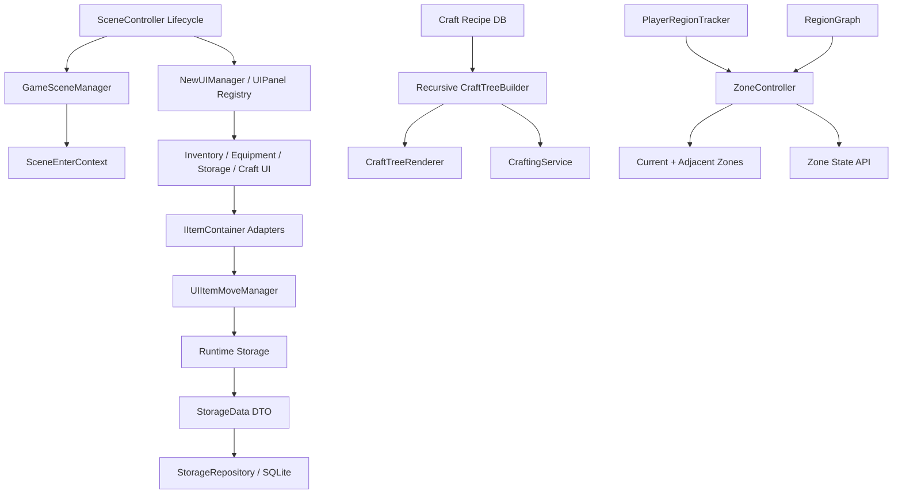

# Architecture Overview

이 프로젝트에서 제가 담당한 핵심은 씬, UI, 제작, 아이템 저장소, 저장/로드, 지역 최적화가 서로 무너지지 않고 연결되는 런타임 구조였습니다.

개별 기능을 빠르게 붙이는 것보다, 기능이 늘어나도 호출 방향과 데이터 흐름이 유지되도록 공통 규격과 중앙 관리 지점을 먼저 만들었습니다.

## High-Level Runtime Flow

## Presentation Flow

1. `SceneController`와 `GameSceneManager`가 씬 전환과 컨텍스트 전달을 통합합니다.
2. `NewUIManager`가 `UIPanelId` 기반으로 패널을 등록하고 공통 Open/Close/Toggle을 처리합니다.
3. 제작 시스템은 레시피 데이터를 재귀 탐색해 런타임 제작 트리를 생성합니다.
4. 인벤토리/창고/장비창/루팅창은 `IItemContainer`와 Adapter로 같은 이동 시스템에 연결됩니다.
5. `UIItemMoveManager`가 이동, 병합, 스왑, 자동 이동, 장비 슬롯 검증을 트랜잭션처럼 처리합니다.
6. 저장 시점에는 런타임 슬롯 모델을 `StorageData` DTO로 변환해 SQLite에 저장합니다.
7. 월드는 `RegionGraph`와 `ZoneController`를 통해 현재 지역과 인접 지역만 활성화합니다.
8. 금지구역, 하이퍼루프, 지역 이벤트 같은 협업 기능은 Zone 내부 구현이 아니라 Region/Zone 상태 API를 통해 연결될 수 있게 했습니다.

## Design Intent

- 결합도 감소: UI 패널, 컨테이너, 저장소, Zone 상태를 직접 참조 대신 ID/인터페이스/API로 연결
- 데이터 흐름 안정화: 이동 검증 후 커밋하고 실패 시 롤백하는 방식으로 아이템 복사/증발 방지
- 데이터 기반 확장: 제작 레시피와 지역 그래프를 데이터로 관리해 코드 수정 없이 확장 가능
- 런타임 최적화: 필요한 Zone만 활성화하고 저장 데이터는 비어있지 않은 슬롯만 추출
- 협업 확장성: 다른 팀원이 만든 지역 기반 기능이 `Region`, `ZoneState`, `ZoneController` API를 통해 붙을 수 있도록 경계 제공

## Measured Optimization

Region 기반 비활성화 적용 후, 거리별 비활성화 기준으로 Update CPU 비용이 평균 약 **2.0ms 감소**했고 평균 기준 약 **42% 최적화**되었습니다. 측정 환경은 9950X 기준입니다.
