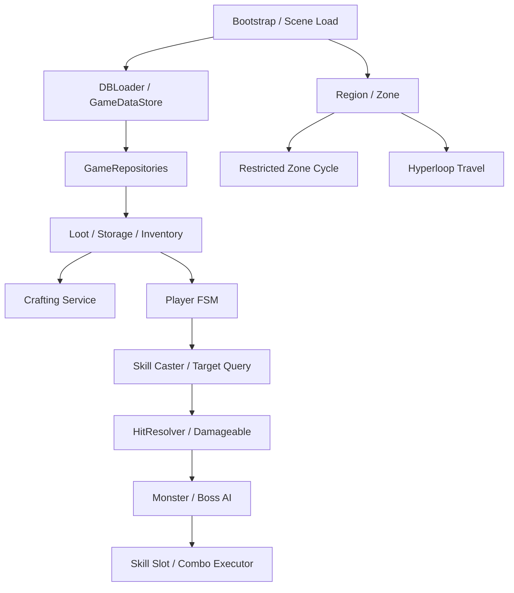

# Architecture Overview

Escape From Eternal Return은 지역 이동, 파밍, 제작, 전투, 몬스터 AI가 동시에 동작하는 탑다운 생존 액션 RPG입니다. 핵심은 런타임 기능을 한 클래스에 몰아넣지 않고, 지역/아이템/전투/AI/데이터 흐름을 각각 설명 가능한 단위로 나눈 것입니다.

## High-Level Flow

## Core Systems

| System | Summary | Detail |
|---|---|---|
| Restricted Zone & Region | 플레이어 현재 지역과 인접 지역을 기준으로 활성 Zone을 갱신하고 금지구역 상태를 전파 | [Restricted Zone](systems/restricted-zone.md) |
| Hyperloop Travel | 지역별 하이퍼루프 상호작용과 목적지 UI를 연결 | [Hyperloop Travel](systems/hyperloop-travel.md) |
| Inventory & Storage | 인벤토리/장비/보관함/루팅 컨테이너를 공통 이동 규칙으로 처리 | [Inventory Storage](systems/inventory-storage.md) |
| Crafting Tree | 제작 가능 여부, 부족 재료, 결과 아이템 지급을 서비스로 분리 | [Crafting Tree](systems/crafting-tree.md) |
| Player Combat | FSM, 스킬 캐스팅, 타겟 쿼리, 상태이상으로 전투 흐름을 구성 | [Player Combat](systems/player-combat.md) |
| Monster / Boss AI | 행동 트리와 스킬/콤보 실행기를 통해 일반 AI와 보스 패턴을 분리 | [Monster AI](systems/monster-ai.md) |
| Data Repository | SQLite/ScriptableObject 데이터를 런타임 시스템에서 직접 만지지 않도록 Repository로 감쌈 | [Data Repository](systems/data-repository.md) |

## Design Intent

- `ZoneController`: 현재 지역과 인접 지역만 활성화해 씬 부하와 상태 갱신 범위를 줄임
- `RestrictedZoneController`: 시간 기반 금지구역 후보/확정 상태를 이벤트로 전파하는 구조
- `Inventory` / `Storage`: 아이템 이동 결과를 EventBus로 UI에 알림
- `CraftingService`: 제작 로직을 UI에서 분리해 테스트 가능한 순수 서비스에 가깝게 구성
- `PlayerFSM`: 점유 상태와 우선순위로 이동/공격/스킬/피격 충돌을 정리
- `SkillCaster`: 캐스팅 중 이동 잠금, 애니메이션 이벤트, 종료 대기를 한 흐름으로 처리
- `BehaviorTree` / `BossComboExecutor`: 조건 판단과 스킬 실행 순서를 분리
- `GameRepositories`: DB 연결명을 한 곳에서 관리하고 런타임 코드에는 도메인 Repository만 노출

## Class Relationship

전체 클래스 관계는 [Class Diagram](class-diagram.md)에서 확인할 수 있습니다.

