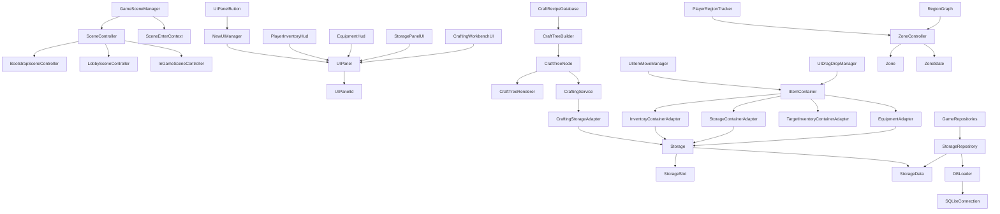

# Class Diagram

## Link Map

- [SceneController](classes/SceneController.md)
- [GameSceneManager](classes/GameSceneManager.md)
- [NewUIManager](classes/NewUIManager.md)
- [UIPanel](classes/UIPanel.md)
- [CraftTreeBuilder](classes/CraftTreeBuilder.md)
- [CraftingService](classes/CraftingService.md)
- [IItemContainer](classes/IItemContainer.md)
- [UIItemMoveManager](classes/UIItemMoveManager.md)
- [Storage](classes/Storage.md)
- [StorageRepository](classes/StorageRepository.md)
- [ZoneController](classes/ZoneController.md)
- [RegionGraph](classes/RegionGraph.md)
