# Class Diagram

```mermaid
flowchart TD
    DataBootstrapper --> DBLoader
    DBLoader --> GameRepositories
    GameRepositories --> ItemRepository
    GameRepositories --> StorageRepository
    GameRepositories --> SaveFileRepository
    GameDataStore --> MonsterDatabase
    GameDataStore --> VFXDatabase
    GameDataStore --> SFXDatabase

    PlayerRegionTracker --> ZoneController
    RegionGraph --> ZoneController
    ZoneController --> Zone
    RestrictedZoneController --> ZoneController

    Hyperloop --> InGameSceneController
    Hyperloop --> NewUIManager

    Inventory --> InventoryEventBus
    Storage --> IItemContainer
    InventoryContainerAdapter --> Inventory
    StorageContainerAdapter --> Storage
    UIDragDropManager --> IItemContainer

    CraftTreeBuilder --> CraftTreeNode
    CraftingService --> CraftingStorageAdapter
    CraftingService --> CraftTreeNode
    CraftTreeRenderer --> CraftTreeNodeView

    PlayerFSM --> IPlayerState
    PlayerFSM --> PlayerMove
    PlayerFSM --> PlayerStat
    PlayerFSM --> SkillManager
    PlayerFSM --> SkillCaster
    SkillCaster --> SkillBase
    SkillBase --> SkillContext
    SkillContext --> ISkillTargetQuery
    ISkillTargetQuery --> IDamageable

    MonsterController --> MonsterMovement
    MonsterController --> MonsterCombat
    BehaviorTree --> BossMonsterNode
    BossMonsterNode --> IStrategy
    BossComboExecutor --> BossMonsterSkillManager
    BossComboExecutor --> BossCombatAction
    BossComboAction --> BossCombatAction
```

## Link Map

- [ZoneController](classes/ZoneController.md)
- [RestrictedZoneController](classes/RestrictedZoneController.md)
- [Hyperloop](classes/Hyperloop.md)
- [Inventory](classes/Inventory.md)
- [Storage](classes/Storage.md)
- [CraftingService](classes/CraftingService.md)
- [PlayerFSM](classes/PlayerFSM.md)
- [SkillCaster](classes/SkillCaster.md)
- [MonsterController](classes/MonsterController.md)
- [BehaviorTree](classes/BehaviorTree.md)
- [GameDataStore](classes/GameDataStore.md)

