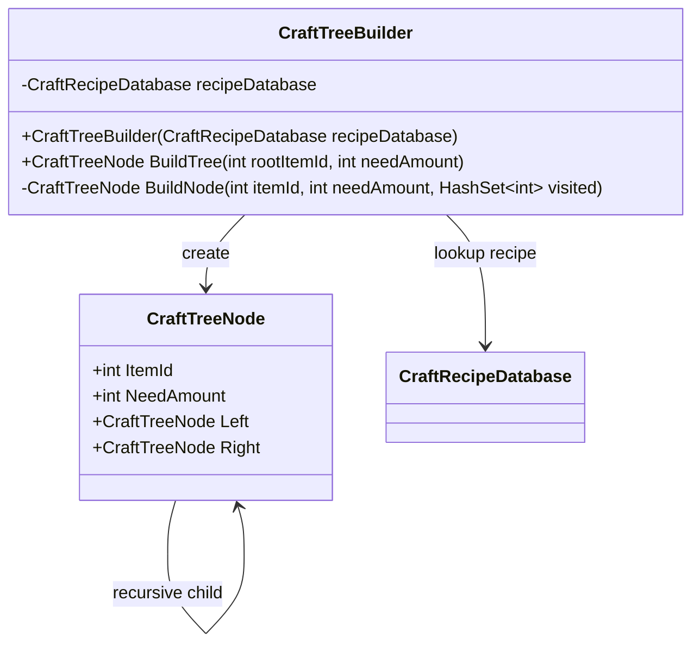

# CraftTreeBuilder

## Role

레시피 데이터를 기반으로 다단계 제작 트리를 재귀적으로 생성합니다.

## Class Diagram

```mermaid
classDiagram
    class CraftTreeBuilder {
        -CraftRecipeDatabase recipeDatabase
        +CraftTreeBuilder(CraftRecipeDatabase recipeDatabase)
        +CraftTreeNode BuildTree(int rootItemId, int needAmount)
        -CraftTreeNode BuildNode(int itemId, int needAmount, HashSet~int~ visited)
    }

    class CraftTreeNode {
        +int ItemId
        +int NeedAmount
        +CraftTreeNode Left
        +CraftTreeNode Right
    }

    class CraftRecipeDatabase

    CraftTreeBuilder --> CraftRecipeDatabase : lookup recipe
    CraftTreeBuilder --> CraftTreeNode : create
    CraftTreeNode --> CraftTreeNode : recursive child
```

## Source

- [CraftTreeBuilder.cs](../../src/Assets/00_Scripts/Craft/CraftTreeBuilder.cs)

