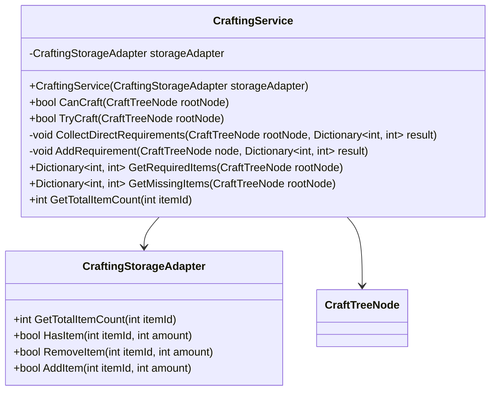

# CraftingService

## Role

제작 가능 여부 판단, 부족 재료 계산, 실제 제작 처리를 담당합니다.

## Class Diagram

```mermaid
classDiagram
    class CraftingService {
        -CraftingStorageAdapter storageAdapter
        +CraftingService(CraftingStorageAdapter storageAdapter)
        +bool CanCraft(CraftTreeNode rootNode)
        +bool TryCraft(CraftTreeNode rootNode)
        -void CollectDirectRequirements(CraftTreeNode rootNode, Dictionary~int, int~ result)
        -void AddRequirement(CraftTreeNode node, Dictionary~int, int~ result)
        +Dictionary~int, int~ GetRequiredItems(CraftTreeNode rootNode)
        +Dictionary~int, int~ GetMissingItems(CraftTreeNode rootNode)
        +int GetTotalItemCount(int itemId)
    }

    class CraftingStorageAdapter {
        +int GetTotalItemCount(int itemId)
        +bool HasItem(int itemId, int amount)
        +bool RemoveItem(int itemId, int amount)
        +bool AddItem(int itemId, int amount)
    }

    class CraftTreeNode

    CraftingService --> CraftingStorageAdapter
    CraftingService --> CraftTreeNode
```

## Source

- [CraftingService.cs](../../src/Assets/00_Scripts/Craft/CraftingService.cs)
