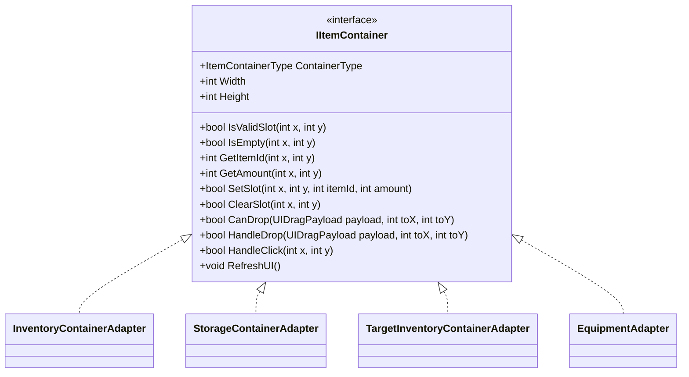

# IItemContainer

## Role

Inventory, Storage, Equipment, Loot UI를 같은 아이템 이동 시스템에 연결하기 위한 공통 컨테이너 인터페이스입니다.

## Class Diagram

## Design Point

각 UI 창의 내부 구조는 다르지만, 이동 시스템은 `IItemContainer`만 보고 슬롯 조회, 검증, 설정, UI 갱신을 처리합니다. 이 구조가 Adapter Pattern의 핵심입니다.

## Source

- [IItemContainer.cs](../../src/Assets/00_Scripts/Storage_Scripts/StorageLogic/IItemContainer.cs)

