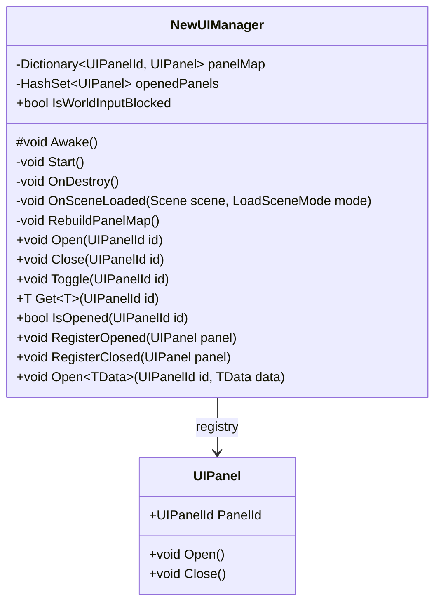

# NewUIManager

## Role

`UIPanelId` 기반으로 UI 패널을 등록하고 공통 Open/Close/Toggle을 처리하는 UI 레지스트리입니다.

## Class Diagram

```mermaid
classDiagram
    class NewUIManager {
        -Dictionary~UIPanelId, UIPanel~ panelMap
        -HashSet~UIPanel~ openedPanels
        #void Awake()
        -void Start()
        -void OnDestroy()
        -void OnSceneLoaded(Scene scene, LoadSceneMode mode)
        -void RebuildPanelMap()
        +void Open(UIPanelId id)
        +void Close(UIPanelId id)
        +void Toggle(UIPanelId id)
        +T Get~T~(UIPanelId id)
        +bool IsOpened(UIPanelId id)
        +void RegisterOpened(UIPanel panel)
        +void RegisterClosed(UIPanel panel)
        +void Open~TData~(UIPanelId id, TData data)
        +bool IsWorldInputBlocked
    }

    class UIPanel {
        +UIPanelId PanelId
        +void Open()
        +void Close()
    }

    NewUIManager --> UIPanel : registry
```

## Source

- [NewUIManager.cs](../../src/Assets/00_Scripts/Core/NewUIManager.cs)

