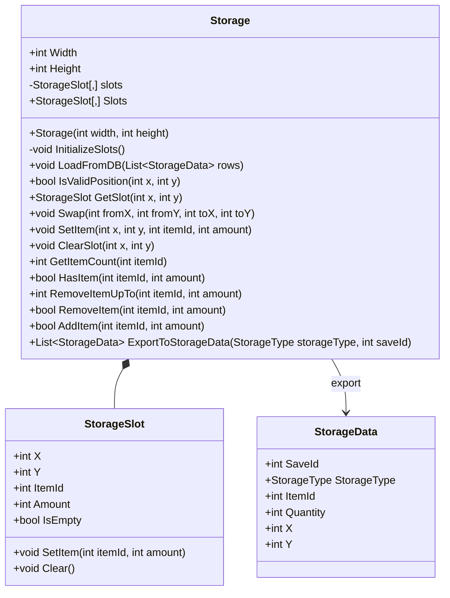

# Storage

## Role

Inventory, Storage, Equipment, Loot이 공유하는 런타임 슬롯 데이터 모델입니다.

## Class Diagram

## Design Point

런타임에서는 2D 슬롯 배열로 빠르게 접근하고, 저장 시점에는 비어있지 않은 슬롯만 `StorageData`로 변환합니다.

## Source

- [Storage.cs](../../src/Assets/00_Scripts/Storage_Scripts/StorageLogic/Storage.cs)

