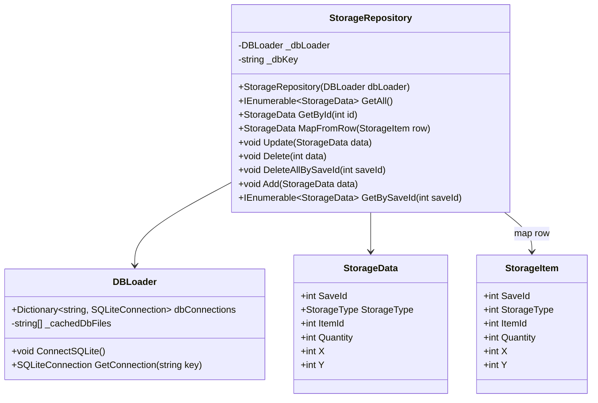

# StorageRepository

## Role

SQLite에 저장된 Storage row와 런타임 저장 DTO인 `StorageData` 사이를 매핑합니다.

## Class Diagram

## Design Point

Repository가 SQLite 접근을 감싸고, 런타임 시스템은 `StorageData` 단위로 저장/로드 흐름을 다룹니다.

## Source

- [StorageRepository.cs](../../src/Assets/00_Scripts/DataBase/StorageRepository.cs)

