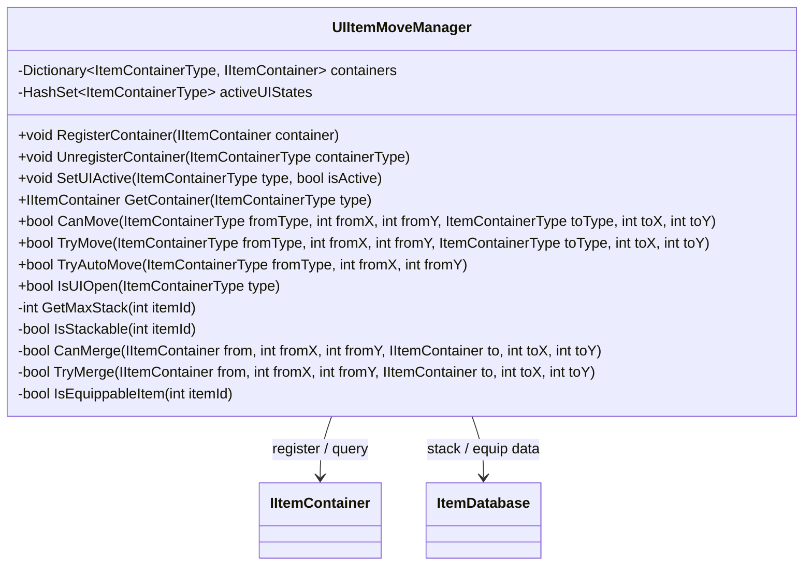

# UIItemMoveManager

## Role

서로 다른 아이템 컨테이너 사이의 이동, 병합, 스왑, 자동 이동을 중앙에서 조율합니다.

## Class Diagram

## Transaction Steps

1. Resolve source/target container.
2. Validate source and target slots.
3. Check merge, swap, equipment validation.
4. Commit slot changes.
5. Roll back if a partial write fails.
6. Refresh affected UI panels.

## Source

- [UIItemMoveManager.cs](../../src/Assets/00_Scripts/Storage_Scripts/StorageLogic/UIItemMoveManager.cs)

