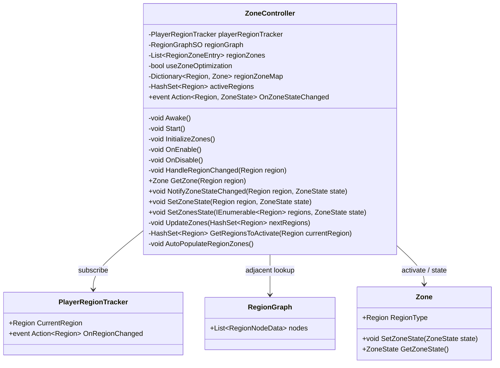

# ZoneController

## Role

플레이어 현재 지역과 인접 지역만 활성화하는 Region 기반 월드 최적화 컨트롤러입니다.

## Class Diagram

## Design Point

`activeRegions`와 다음 활성 지역 집합의 차집합만 계산해 필요한 Zone만 켜고 끕니다. 금지구역이나 지역 이벤트 같은 협업 기능은 `SetZoneState`와 이벤트를 통해 붙을 수 있습니다.

## Source

- [ZoneController.cs](../../src/Assets/00_Scripts/ZoneControllers/ZoneController.cs)

