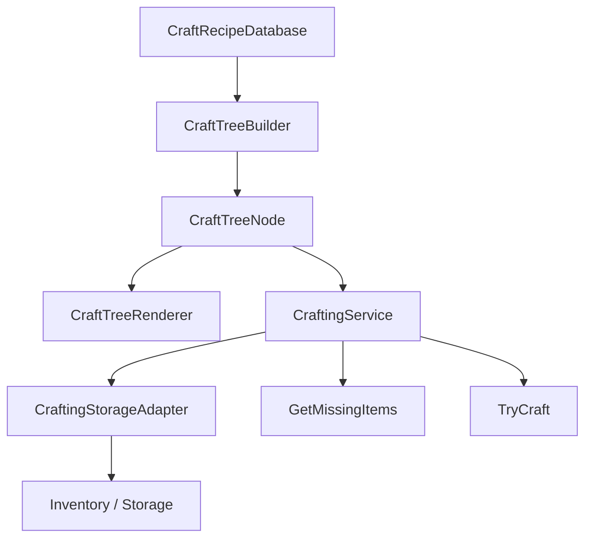

# Crafting Tree

## Problem

제작 시스템은 결과 아이템, 필요한 재료, 보유 수량, 부족 수량, 제작 가능 여부, 제작 트리 표시가 동시에 필요합니다. 이 로직이 UI에 들어가면 제작 규칙을 테스트하거나 재사용하기 어렵습니다.

## Solution

`CraftTreeBuilder`가 제작 트리를 만들고, `CraftingService`가 제작 가능 여부와 재료 차감/결과 지급을 담당합니다. UI는 `CraftTreeRenderer`와 `CraftTreeNodeView`를 통해 결과를 표시합니다.

## Flow

## Code Points

- `CraftingService.CanCraft`: 필요 재료와 보유 수량 비교
- `TryCraft`: 재료 제거 후 결과 아이템 추가
- `GetRequiredItems`: 직접 하위 노드 재료를 합산
- `GetMissingItems`: UI에서 부족 재료를 표시할 수 있도록 계산 결과 제공

## Portfolio Point

제작 로직을 UI에서 분리했기 때문에, 같은 제작 규칙을 워크벤치 UI, 검색 테이블, 디버그 러너에서 재사용할 수 있습니다.

