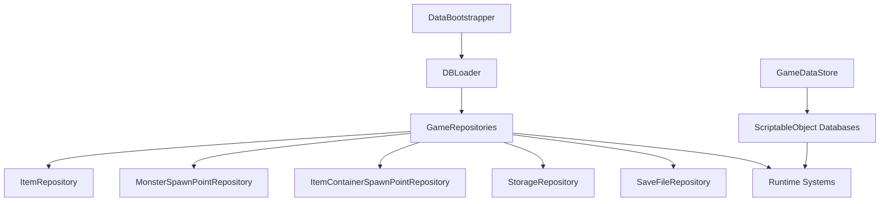

# Data Repository

## Problem

아이템, 몬스터 스폰, 저장 파일, 보관함 데이터는 SQLite/CSV/ScriptableObject 등 서로 다른 출처를 가질 수 있습니다. 런타임 코드가 직접 DB 연결명을 알고 쿼리하면 데이터 구조 변경이 전체 코드로 퍼집니다.

## Solution

`DBLoader`가 DB 연결을 제공하고, `GameRepositories`가 도메인별 Repository를 생성합니다. 런타임 시스템은 `ItemRepository`, `StorageRepository`, `SaveFileRepository` 같은 목적별 객체를 통해 데이터에 접근합니다. ScriptableObject 기반 공용 데이터는 `GameDataStore`가 참조 허브 역할을 합니다.

## Flow

## Code Points

- `GameRepositories`: DB 연결명을 한 곳에서 모아 Repository 생성
- `IReadOnlyRepository`, `IWriteRepository`, `IRepository`: 읽기/쓰기 계약 분리
- `StorageRepository`: 저장소 데이터를 DBLoader 기반으로 접근
- `GameDataStore`: 몬스터/VFX/SFX/BGM/발소리/보이스 DB와 컨테이너 프리팹 참조 제공

## Portfolio Point

데이터 계층은 런타임 시스템과 저장 매체를 느슨하게 연결합니다. 이 구조 덕분에 아이템 DB나 저장 파일 구현이 바뀌어도 게임 로직은 Repository 계약만 유지하면 됩니다.

