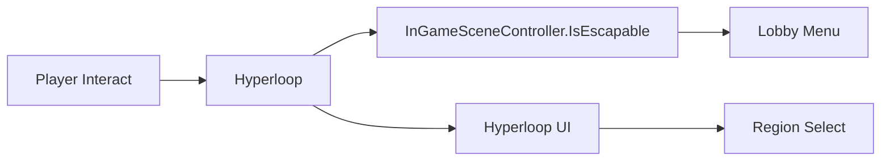

# Hyperloop Travel

## Problem

지역 이동은 UI, 씬 상태, 플레이어 위치, 탈출 가능 여부와 연결됩니다. 상호작용 오브젝트가 이 모든 규칙을 직접 처리하면 지역 이동 정책이 오브젝트마다 흩어집니다.

## Solution

`Hyperloop`은 자신이 속한 `Region`만 알고, 상호작용 시 현재 지역이 탈출 가능한지 확인한 뒤 필요한 UI를 엽니다. 실제 이동 목적지 선택과 화면 처리는 `NewUIManager`와 씬 컨트롤러 쪽으로 위임합니다.

## Flow

## Code Points

- `Hyperloop.Region`: 오브젝트가 담당하는 지역 정보
- `Interact`: 탈출 가능 여부 확인과 UI 오픈을 연결
- `HyperloopRegionUI`: 지역 선택 UI를 별도 계층에서 담당
- `Region`: 지역 이동과 금지구역 시스템이 공유하는 enum 기반 기준

## Portfolio Point

하이퍼루프는 작은 클래스지만, “상호작용 오브젝트는 의도만 발생시키고 실제 화면/씬 정책은 매니저가 처리한다”는 구조를 보여줍니다.

