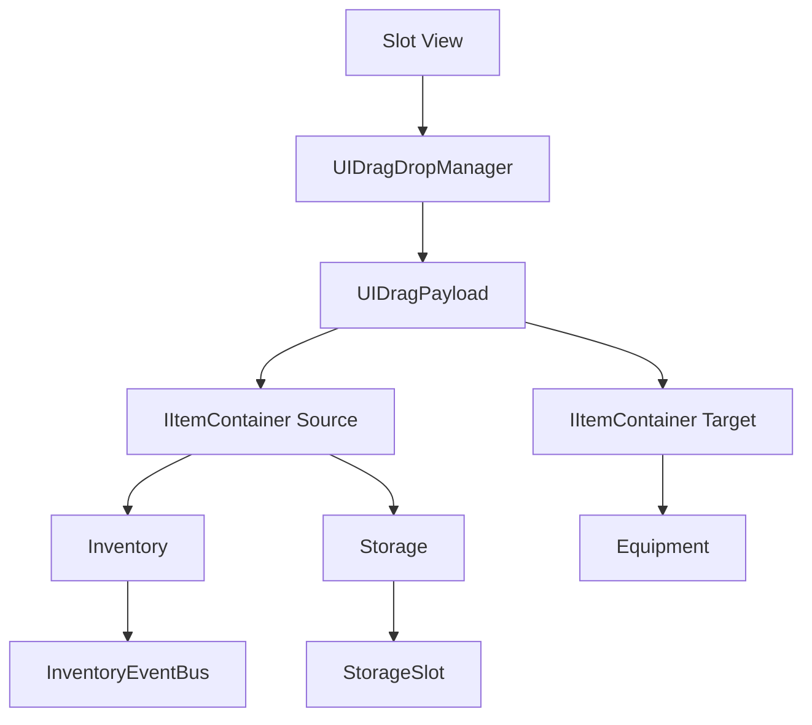

# Inventory & Storage

## Problem

인벤토리, 장비, 보관함, 루팅 컨테이너는 모두 “슬롯에 있는 아이템을 이동한다”는 공통점을 가지지만, UI와 데이터 구조가 조금씩 다릅니다. 각 UI가 직접 이동 로직을 가지면 드래그, 퀵무브, 장착, 사용 처리의 예외가 빠르게 늘어납니다.

## Solution

아이템 컨테이너를 `IItemContainer`와 Adapter 계층으로 감싸고, 실제 UI 조작은 `UIDragDropManager`, `UIItemMoveManager`, `UIItemUseManager` 같은 서비스성 클래스가 처리합니다. `Inventory`는 배열 기반 슬롯과 이벤트 발행에 집중합니다.

## Flow

## Code Points

- `Inventory.AddItem/RemoveItem/SwapItems/TakeItem`: 슬롯 변경의 핵심 연산
- `InventoryEventBus`: 데이터 변경을 UI 갱신과 분리
- `StorageContainerAdapter`, `InventoryContainerAdapter`: 서로 다른 컨테이너를 공통 조작 인터페이스로 연결
- `BaseItemSlotView`: 슬롯 UI의 공통 표현 계층

## Portfolio Point

이 시스템의 핵심은 UI 편의를 위해 로직을 UI에 넣지 않은 점입니다. 컨테이너 추상화를 두면 장비창, 보관함, 루팅창이 늘어나도 이동 규칙을 재사용할 수 있습니다.

