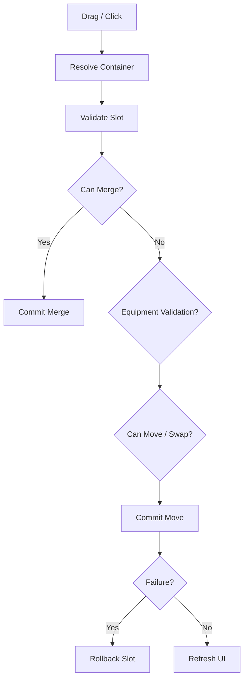

# Item Container Transaction

## Problem

인벤토리, 창고, 장비창, 루팅창은 화면 형태와 세부 규칙은 다르지만 결국 “슬롯에서 아이템을 꺼내 다른 슬롯에 넣는다”는 공통 흐름을 가집니다. 이를 각 UI에서 따로 구현하면 이동 규칙이 중복되고, 아이템 복사/증발 같은 데이터 무결성 문제가 발생하기 쉽습니다.

## Solution

모든 컨테이너를 `IItemContainer` 인터페이스로 통일하고, 각 UI/데이터 모델은 Adapter를 통해 같은 슬롯 조작 API를 제공합니다. `UIItemMoveManager`는 구체 UI 타입을 직접 알지 않고, 인터페이스만 사용해 이동 가능 여부 검증, 스택 병합, 스왑, 자동 이동, 장비 슬롯 검증, UI 갱신을 처리합니다.

## Transaction Flow

## Pattern / Stack

- Adapter Pattern: 서로 다른 UI/데이터 모델을 `IItemContainer`로 맞춤
- Mediator / Facade: `UIItemMoveManager`가 컨테이너 간 이동을 중앙 조율
- Transaction-like Commit: 검증 후 쓰기, 실패 시 롤백
- Rule Priority: 열려 있는 UI 상태와 아이템 타입에 따라 자동 이동 목적지 결정

## Code Points

- `IItemContainer`: 슬롯 조회, 비어 있음 확인, Set/Clear, Drop/Click, Refresh 계약
- `InventoryContainerAdapter`: 인벤토리 HUD와 `Storage` 모델 연결
- `StorageContainerAdapter`: 창고 패널과 `Storage` 모델 연결
- `TargetInventoryContainerAdapter`: 루팅 창 연결
- `EquipmentAdapter`: 장비 슬롯 타입 검증과 스탯 반영
- `UIItemMoveManager.CanMove`: 이동 가능성 검증
- `UIItemMoveManager.TryMove`: 병합/스왑/순수 이동 커밋
- `UIItemMoveManager.TryAutoMove`: UI 상태별 자동 이동 우선순위

## Portfolio Point

새로운 창이 추가되어도 `IItemContainer` 규격만 맞추면 기존 이동, 병합, 스왑, 저장 흐름에 그대로 연결할 수 있습니다. 이 구조는 기능 확장보다 데이터 무결성 유지에 초점을 둔 설계입니다.

