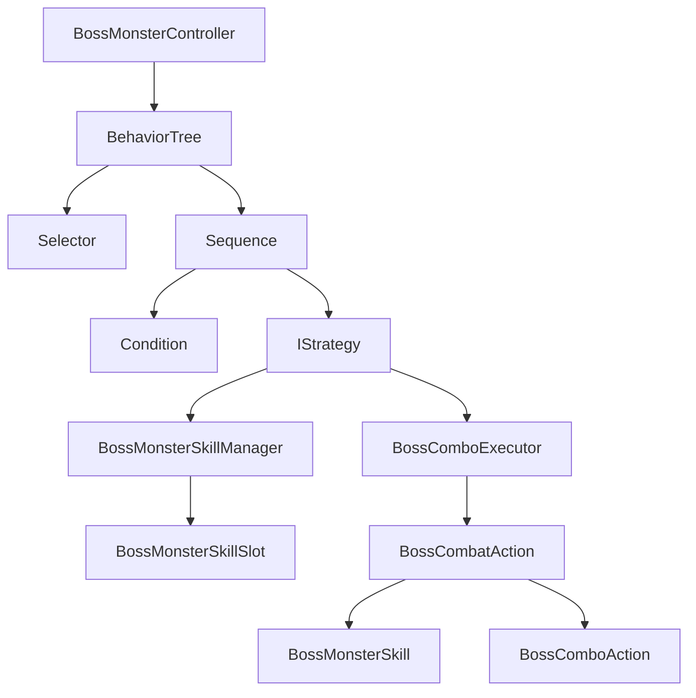

# Monster / Boss AI

## Problem

몬스터 AI는 추적, 공격, 복귀, 스킬 사용, 페이즈 전환 같은 조건이 많습니다. 특히 보스는 일반 몬스터보다 패턴과 콤보가 복잡해져 거대한 조건문으로 만들면 유지보수가 어렵습니다.

## Solution

일반 몬스터는 FSM/행동 트리 노드 구조로 상태를 나누고, 보스는 `BehaviorTree`, `Selector`, `Sequence`, `Strategy` 계층으로 판단과 실행을 분리합니다. `BossComboExecutor`는 단일 스킬 또는 중첩 콤보 액션을 순차적으로 실행합니다.

## Flow

## Code Points

- `BehaviorTree.Process`: 자식 노드가 실패/진행 중이면 즉시 반환
- `PrioritySelector`: 우선순위가 높은 조건부터 평가하는 구조
- `IStrategy`: 순찰, 추적, 복귀, 스킬 사용 같은 실행 단위
- `BossComboExecutor.ExecuteAction`: 스킬과 콤보를 같은 액션 타입으로 재귀 처리
- `BossMonsterSkillSlot`: 쿨타임/실행 상태를 스킬 단위로 관리

## Portfolio Point

AI 구조의 장점은 “판단 트리”와 “스킬 실행”이 분리되어 있다는 점입니다. 새 보스 패턴을 만들 때 조건 노드, 전략, 액션 조합을 추가하는 식으로 확장할 수 있습니다.

