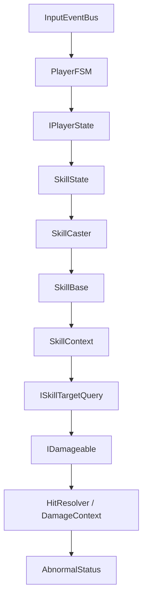

# Player Combat

## Problem

플레이어는 이동, 기본 공격, 스킬, 상호작용, 스턴, 넉백, 사망 상태를 동시에 받을 수 있습니다. 상태 전이가 명확하지 않으면 캐스팅 중 이동하거나, 스턴 중 스킬이 나가거나, 사망 후 입력이 처리되는 문제가 생깁니다.

## Solution

`PlayerFSM`은 상태 객체를 소유하고 현재 상태의 `IsOccupying`과 `Priority`를 기준으로 전이를 제한합니다. `SkillCaster`는 캐스팅 중 이동을 잠그고, 애니메이션 이벤트와 스킬 종료를 코루틴으로 기다립니다. 타겟 탐색은 `ISkillTargetQuery` 구현체로 분리해 원형/부채꼴/직선/컨텍스트 타겟팅을 바꿔 끼울 수 있습니다.

## Flow

## Code Points

- `PlayerFSM.StateConverter`: enum 요청을 실제 상태 객체로 변환
- `PlayerFSM.ChangeState`: Exit/Enter와 상태 변경 이벤트 발행
- `SkillCaster.Cast`: 점유 스킬과 비점유 스킬의 실행 흐름 분리
- `SkillCaster.Cancel`: 캐스팅 취소와 이동 복구
- `ISkillTargetQuery`: 스킬별 타겟 탐색 전략 분리

## Portfolio Point

플레이어 전투 구조는 “상태 전이”, “스킬 실행”, “타겟 탐색”, “효과 적용”을 분리해 액션 RPG에서 흔히 발생하는 입력/전투 충돌을 제어하려는 설계입니다.

