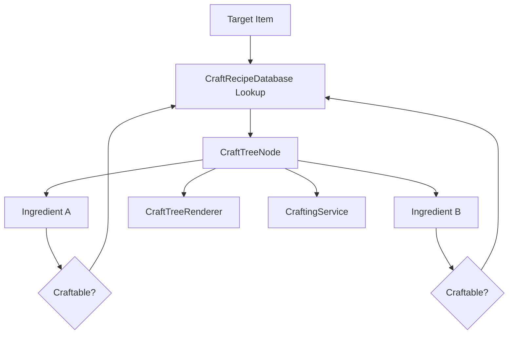

# Recursive Crafting Tree

## Problem

제작 시스템은 결과 아이템의 재료가 다시 제작 가능한 아이템일 수 있습니다. 단순히 “결과 아이템 + 재료 2개”만 표시하면 다단계 조합식을 표현하기 어렵고, 레시피 데이터가 바뀔 때마다 UI 코드를 수정해야 합니다.

## Solution

`CraftTreeBuilder`가 제작 결과 아이템에서 시작해 레시피 DB를 조회하고, 재료가 다시 제작 가능한 아이템이면 같은 탐색을 반복합니다. 이렇게 만든 `CraftTreeNode` 트리를 `CraftTreeRenderer`가 런타임 UI로 변환하고, `CraftingService`는 제작 가능 여부와 실제 재료 차감/결과 지급만 담당합니다.

## Flow

## Pattern / Stack

- Recursive Tree Construction: 재료가 제작 가능하면 하위 트리를 반복 생성
- Data-driven UI: 레시피 데이터 기반으로 제작 UI 자동 재구성
- Separation of Concerns: 트리 생성, UI 렌더링, 제작 실행을 분리

## Code Points

- `CraftTreeBuilder`: 레시피 데이터를 따라 제작 트리 생성
- `CraftTreeNode`: 결과 아이템과 하위 재료 노드 표현
- `CraftTreeRenderer`: 트리를 UI 노드로 변환
- `CraftingService`: `CanCraft`, `TryCraft`, `GetMissingItems`
- `CraftingStorageAdapter`: 인벤토리/창고 보유량을 제작 서비스에 제공

## Portfolio Point

조합식 데이터가 런타임 중 바뀌어도 코드 수정 없이 제작 트리가 다시 구성됩니다. 제작 로직이 UI에 묶이지 않아 검색 테이블, 제작대 UI, 디버그 러너에서 같은 규칙을 재사용할 수 있습니다.

