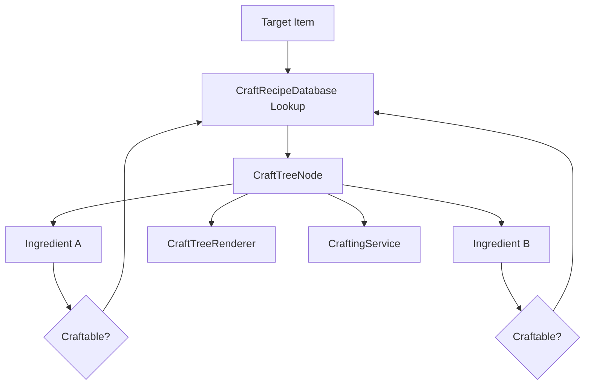

# Recursive Crafting Tree

## Problem

이 시스템은 이터널 리턴처럼 최상위 아이템을 선택해도 최하위 재료까지 확인할 수 있게 만드는 것이 출발점이었습니다. 상위 아이템은 하위 재료 두 개로 이어지고, 그 재료도 다시 제작 아이템일 수 있습니다. 탐색 결과를 찾는 즉시 UI에 하나씩 붙이면 화면이 단계적으로 갱신되는 느낌이 생길 수 있어, 먼저 전체 제작 구조를 만든 뒤 보여주고자 했습니다.

## Solution

`CraftTreeBuilder`가 제작 결과 아이템에서 시작해 **ScriptableObject 레시피 데이터**를 조회하고, 재료가 다시 제작 가능한 아이템이면 같은 탐색을 반복합니다. 이렇게 완성한 `CraftTreeNode` 트리를 `CraftTreeRenderer`가 런타임 UI로 변환합니다. `CraftingService`는 사용자의 제작 요청을 받아 제작 가능 여부, 부족 재료, 실제 재료 차감과 결과 지급을 담당합니다.

## Flow

```mermaid
flowchart TD
    Target[Target Item] --> Search[CraftRecipeDatabase Lookup]
    Search --> Node[CraftTreeNode]
    Node --> IngredientA[Ingredient A]
    Node --> IngredientB[Ingredient B]
    IngredientA --> RecursiveA{Craftable?}
    IngredientB --> RecursiveB{Craftable?}
    RecursiveA --> Search
    RecursiveB --> Search
    Node --> Renderer[CraftTreeRenderer]
    Node --> Service[CraftingService]
```

## Pattern / Stack

- Recursive Tree Construction: 재료가 제작 가능하면 하위 트리를 반복 생성
- Data-driven UI: 레시피 데이터 기반으로 제작 UI 자동 재구성
- Separation of Concerns: 트리 생성, UI 렌더링, 제작 실행을 분리

## Code Points

- `CraftTreeBuilder`: 레시피 데이터를 따라 제작 트리 생성
- `CraftTreeNode`: 결과 아이템과 하위 재료 노드 표현
- `CraftTreeRenderer`: 트리를 UI 노드로 변환
- `CraftingService`: `CanCraft`, `TryCraft`, `GetMissingItems`
- `CraftingStorageAdapter`: 인벤토리/창고 보유량을 제작 서비스에 제공

## Portfolio Point

제작 규칙을 UI에서 직접 조립하지 않고 데이터 조회 → 트리 생성 → 출력으로 나눴습니다. 따라서 최상위 아이템부터 최하위 재료까지의 조회 규칙을 한 곳에서 유지하면서도, UI는 완성된 결과를 안정적으로 그리는 역할에 집중할 수 있습니다.
