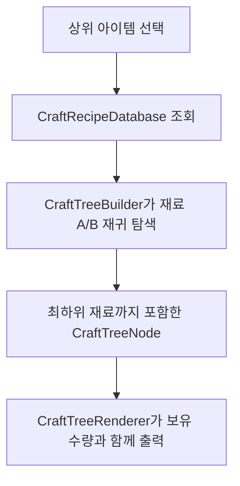

# 전체 목표를 먼저 보여 주는 제작 트리

## 제작은 재료를 빼는 버튼 이상이어야 했습니다

이 게임에서 제작은 탐험에서 얻은 재료를 조합해 다음 탐험의 생존력을 높이는 과정입니다. 상위 장비를 목표로 삼았을 때 플레이어가 알고 싶은 것은 지금 바로 만들 수 있는지뿐 아니라, 이미 가진 재료와 앞으로 무엇을 파밍해야 하는지입니다.

그래서 이터널 리턴처럼 상위 아이템 하나를 선택해도 최하위 재료까지 관계를 살펴볼 수 있게 했습니다. 재료는 다시 제작 아이템일 수 있으므로, 화면이 아니라 데이터부터 재귀적으로 완성해야 했습니다.

## 먼저 트리를 만들고, 그 다음에 화면을 그렸습니다

조회 과정에서 노드를 하나씩 화면에 붙이는 대신, `CraftTreeBuilder`가 ScriptableObject 레시피를 따라 전체 `CraftTreeNode`를 먼저 만들고 `CraftTreeRenderer`가 완성된 결과를 출력하도록 나눴습니다. 정보가 완성되기 전에 화면이 조금씩 바뀌는 것보다, 목표와 재료 관계를 한 번에 보여주는 편이 제작 계획을 세우기 더 자연스럽다고 생각했습니다.

```mermaid
flowchart TD
    Select[상위 아이템 선택] --> Lookup[CraftRecipeDatabase 조회]
    Lookup --> Build[CraftTreeBuilder가 재료 A/B 재귀 탐색]
    Build --> Tree[최하위 재료까지 포함한 CraftTreeNode]
    Tree --> Render[CraftTreeRenderer가 보유 수량과 함께 출력]
```

레시피는 결과물과 재료 A/B 두 개를 가진 `CraftRecipe` ScriptableObject로 관리합니다. `CraftRecipeDatabase`는 결과 아이템 ID를 키로 레시피를 찾고, `CraftTreeBuilder`는 현재 탐색 경로를 `visited`로 관리해 순환 레시피가 있어도 무한 재귀에 빠지지 않게 했습니다.

## 화면에서 보는 전체 경로와 실제 제작은 구분했습니다

트리 화면은 최하위 재료까지 보여주지만, 제작 버튼을 누르면 선택한 아이템의 직접 재료 두 개부터 확인하고 차감합니다. 즉 플레이어는 전체 목표를 미리 확인한 뒤, 필요한 중간 재료를 단계적으로 만들어 올라갑니다.

`CraftingService`는 인벤토리와 창고의 보유 수량을 합산해 제작 가능 여부를 확인하고, 재료를 인벤토리부터 차감한 뒤 부족분을 창고에서 차감합니다. 결과물은 인벤토리에 넣고, 공간이 없으면 창고에 추가합니다. 장비창은 제작 재료의 조회·차감 대상에 포함하지 않았습니다.

## 코드에서 확인할 수 있는 지점

- `CraftRecipe`, `CraftRecipeDatabase`: ScriptableObject 기반 레시피와 결과 아이템 ID 조회
- `CraftTreeBuilder`: 재료 관계를 재귀로 구성하고 순환을 방지
- `CraftTreeRenderer`: 완성된 트리를 UI 노드와 연결선으로 출력
- `CraftingService`: 직접 재료 확인, 차감, 결과 지급
- `CraftingStorageAdapter`: 인벤토리·창고 사이의 보유 수량과 차감 흐름 제공
- `CraftingWorkbenchUI`: 아이템 선택 → 트리 출력 → 제작 → UI 갱신 연결

## 남은 고민

현재 트리와 UI 노드는 조회할 때마다 새로 만듭니다. 제작 데이터가 커진다면 트리 캐싱이나 UI 재사용을 검토할 수 있습니다. 또한 결과물을 넣을 공간이 없는 경우, 이미 차감한 재료까지 완전히 되돌리는 제작 트랜잭션은 보강이 필요합니다.
