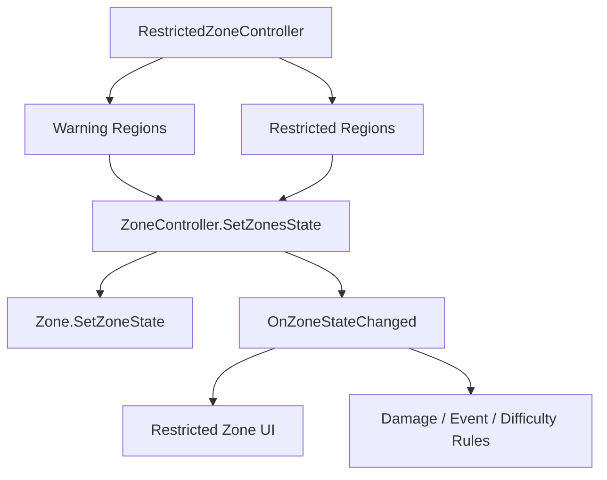

# Restricted Zone Extension API

## Problem

금지구역 시스템은 지역 상태를 바꾸지만, Zone 내부의 몬스터/상자/이벤트 구현에 직접 의존하면 협업 중 변경 비용이 커집니다. 금지구역 담당자는 “어느 Region이 경고/금지 상태인가”만 알면 되고, Zone 내부 구현은 숨겨져야 합니다.

## Solution

`ZoneController`가 `SetZoneState`, `SetZonesState`, `OnZoneStateChanged`를 제공해 Zone 상태 변경 API를 분리합니다. 금지구역 시스템은 Region 목록과 상태만 전달하고, 실제 Zone 오브젝트 조회와 상태 반영은 `ZoneController`가 담당합니다.

## Flow

## Pattern / Stack

- Facade: 외부 시스템은 `ZoneController` API만 호출
- Observer: 상태 변경 이벤트로 UI/룰 시스템 확장 가능
- Open/Closed Principle: Zone 내부 구현을 바꾸지 않고 금지구역 반응을 추가 가능

## Code Points

- `ZoneController.SetZoneState`: 단일 지역 상태 변경
- `ZoneController.SetZonesState`: 여러 지역 상태 일괄 변경
- `ZoneController.OnZoneStateChanged`: 상태 변경 이벤트
- `Zone.SetZoneState`: Zone 내부 상태 갱신
- `RestrictedZoneController`: 경고/금지 후보를 선택하는 확장 지점

## Portfolio Point

금지구역 시스템을 Zone 내부 구현과 분리했기 때문에, UI 알림, 데미지 룰, 스폰 변화, 이벤트 발생 같은 협업 기능을 같은 상태 API 위에 얹을 수 있습니다.
