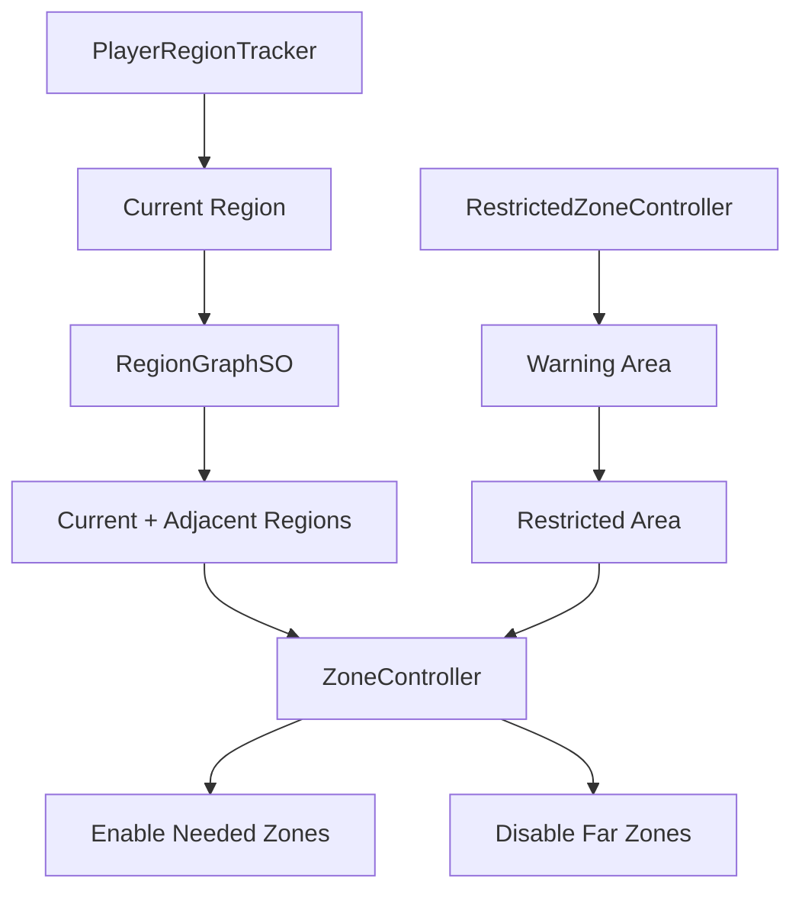

# Restricted Zone & Region

## Problem

생존 장르에서는 시간이 지날수록 플레이 가능한 지역이 줄어들고, 플레이어의 현재 지역에 따라 주변 오브젝트와 몬스터 스폰 상태도 달라집니다. 이 로직이 UI, 스폰, 씬 오브젝트에 흩어지면 금지구역 표시와 실제 월드 상태가 어긋나기 쉽습니다.

## Solution

`ZoneController`는 `PlayerRegionTracker`의 현재 지역을 기준으로 현재 지역과 인접 지역만 활성화합니다. `RegionGraphSO`가 인접 지역 정보를 제공하고, `ZoneController`는 `Region -> Zone` 맵을 만들어 상태 변경을 한 곳에서 처리합니다.

`RestrictedZoneController`는 시간 기반으로 경고 지역과 확정 금지구역을 나누고, 상태 변경을 이벤트로 외부에 알리도록 설계되어 있습니다.

## Flow

## Code Points

- `ZoneController.Awake`: 자식 `Zone`을 수집해 `regionZoneMap` 구성
- `GetRegionsToActivate`: 현재 지역과 인접 지역만 활성 후보로 계산
- `UpdateZones`: 이전 활성 지역과 다음 활성 지역을 비교해 필요한 GameObject만 토글
- `SetZoneState`: 외부 시스템이 지역 상태를 변경할 수 있는 단일 진입점

## Portfolio Point

지역 시스템은 단순히 오브젝트를 켜고 끄는 기능이 아니라, 월드 최적화와 생존 규칙을 연결하는 중심축입니다. 이 구조를 통해 금지구역, 하이퍼루프, 몬스터 스폰, 지역 UI가 같은 `Region` 개념을 공유할 수 있습니다.

