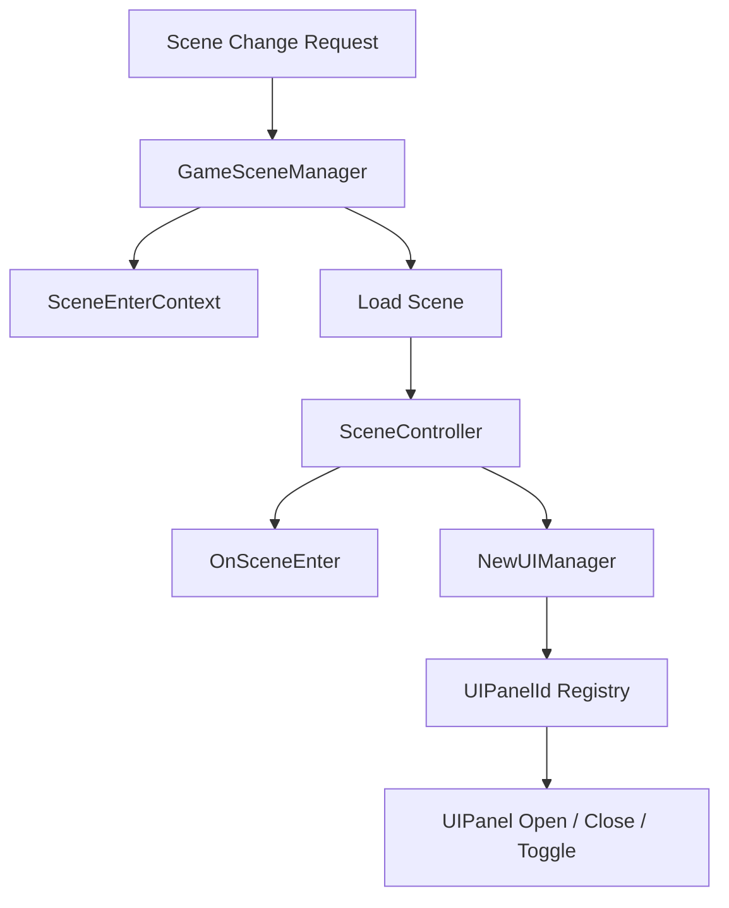

# Scene Lifecycle & UI Registry

## Problem

씬 전환, 씬 진입 데이터, UI 패널 호출이 각 씬에 흩어지면 씬이 늘어날수록 전환 순서와 UI 상태가 어긋나기 쉽습니다. 특히 인게임 UI, 로비 UI, 제작 UI처럼 씬마다 필요한 패널이 달라질 때 직접 참조 방식은 유지보수가 어렵습니다.

## Solution

모든 씬은 `SceneController` 계층을 통해 공통 라이프사이클을 따르고, `GameSceneManager`가 씬 전환과 컨텍스트 전달을 담당합니다. UI는 `UIPanelId`를 가진 `UIPanel`로 통일하고, `NewUIManager`가 등록된 패널을 ID 기반으로 Open/Close/Toggle 합니다.

## Flow

## Pattern / Stack

- Template Method 성격: 씬별 컨트롤러가 공통 라이프사이클을 상속
- Registry: `UIPanelId`를 키로 패널 등록/조회
- Facade: UI 호출자는 패널 직접 참조 대신 `NewUIManager.Open/Close/Toggle` 호출

## Code Points

- `SceneController`: 씬별 공통 진입/종료 흐름의 기반
- `GameSceneManager`: 씬 전환과 컨텍스트 전달의 중앙 지점
- `UIPanel`: 모든 패널이 따르는 공통 규격
- `NewUIManager`: 패널 등록, 조회, 열기/닫기/토글 처리
- `UIPanelButton`: 버튼 입력을 `UIPanelId` 명령으로 변환

## Portfolio Point

새 UI가 추가되어도 `UIPanel`을 상속하고 `UIPanelId`만 지정하면 기존 UI 호출 구조에 들어올 수 있습니다. 씬 전환도 컨텍스트를 통해 전달되므로 씬끼리 직접 참조하지 않는 방향을 유지합니다.

