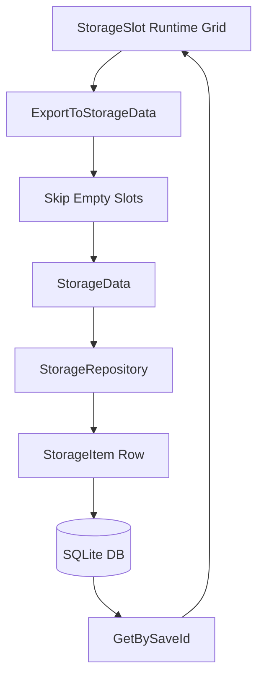

# Storage Persistence

## Problem

런타임 아이템 저장소는 2차원 슬롯 배열로 관리되지만, DB 저장 구조는 세이브 슬롯, 컨테이너 타입, 아이템 ID, 수량, 좌표가 필요합니다. 런타임 모델을 그대로 DB에 묶으면 UI/게임 로직과 저장 구조가 강하게 결합됩니다.

## Solution

`Storage`는 런타임에서 `StorageSlot[,]` 배열로 슬롯을 관리하고, 저장 시점에 비어있지 않은 슬롯만 `StorageData` DTO로 변환합니다. `StorageRepository`는 `StorageData`와 SQLite 테이블 row 사이의 매핑을 담당하고, `DBLoader`는 DB 파일 검색, 연결 캐싱, 닫힌 연결 복구를 처리합니다.

## Flow

## Pattern / Stack

- Repository Pattern: SQLite 접근을 `StorageRepository`로 캡슐화
- DTO Mapping: 런타임 `StorageSlot`과 저장용 `StorageData` 분리
- Data Minimization: 비어있지 않은 슬롯만 저장
- Connection Cache: `DBLoader`가 DB 파일 목록과 연결을 관리

## Code Points

- `Storage.ExportToStorageData`: 저장 시점 DTO 변환
- `StorageData`: 저장 슬롯의 타입, 세이브 ID, 아이템 ID, 수량, 좌표 보관
- `StorageRepository.Add`: DTO를 SQLite row로 변환 후 저장
- `StorageRepository.GetBySaveId`: 특정 세이브 슬롯 데이터만 로드
- `DBLoader.GetConnection`: 연결 캐싱과 재연결 처리

## Portfolio Point

저장 구조는 런타임 UI와 분리되어 있습니다. 저장 시점에 필요한 데이터만 추출하므로 DB 저장량이 줄고, 세이브 슬롯별 데이터 삭제/로드도 Repository 단위로 처리할 수 있습니다.

