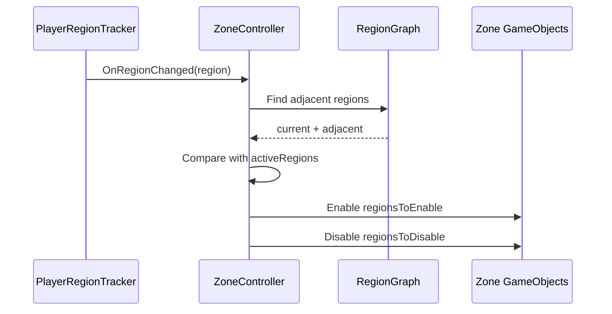

# RegionGraph Zone Culling

## Problem

전체 월드의 모든 지역, 몬스터, 상자 오브젝트를 항상 활성화하면 플레이어가 보지 않는 영역까지 Update와 렌더링 비용이 발생합니다. 월드 규모가 커질수록 이 비용은 누적됩니다.

## Solution

월드를 `Region` 단위의 `Zone`으로 분리하고, `PlayerRegionTracker`가 감지한 현재 지역을 기준으로 `RegionGraph`에서 인접 지역을 조회합니다. `ZoneController`는 현재 지역과 인접 지역만 `activeRegions`로 유지하고, 이전 활성 지역과 다음 활성 지역의 차집합만 계산해 GameObject 활성 상태를 변경합니다.

## Flow

## Pattern / Stack

- Graph-based Culling: RegionGraph로 인접 지역 계산
- Set Difference Optimization: `HashSet.ExceptWith`로 활성/비활성 대상만 계산
- Data-driven World Partition: Zone과 RegionGraph 데이터 기반 월드 분할
- Flyweight Direction: 공통 지역 설정을 ScriptableObject로 분리하면 중복 상태를 더 줄일 수 있음

## Code Points

- `ZoneController.regionZoneMap`: `Region -> Zone` 빠른 조회 맵
- `activeRegions`: 현재 유지 중인 활성 지역 집합
- `GetRegionsToActivate`: 현재 지역 + 인접 지역 계산
- `UpdateZones`: 이전/다음 집합 차이만 토글
- `Zone`: 지역별 몬스터/상자 스폰과 상태 보유

## Portfolio Point

전체 월드를 항상 켜두지 않고 현재 지역과 인접 지역만 활성화합니다. 거리별 비활성화 기준으로 Update CPU 비용이 평균 약 2.0ms 감소했고, 평균 기준 약 42% 최적화되었습니다.

