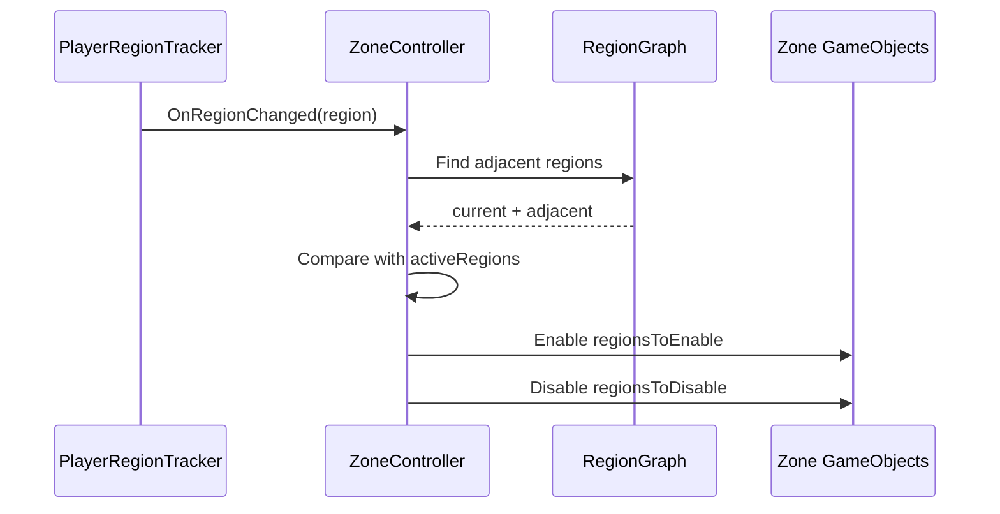

# RegionGraph Zone Culling

## Problem

맵 에셋이 넓고 무거운 상태에서 몬스터와 상자 같은 런타임 요소까지 함께 늘어나면, 전 지역을 항상 활성 상태로 두는 구조는 이후 Update 비용을 키울 수 있다고 판단했습니다. 여기서 해결하려던 것은 렌더러가 그릴 대상을 거르는 프러스텀 컬링이 아니라, 지역 GameObject 자체의 런타임 활성 범위를 관리하는 일이었습니다.

## Solution

월드를 `Region` 단위의 `Zone`으로 분리하고, `PlayerRegionTracker`가 플레이어 하단에서 바닥 Collider를 감지해 현재 지역을 알아냅니다. 이후 `RegionGraph`에서 인접 지역을 조회하고, `ZoneController`는 현재 지역과 인접 지역만 `activeRegions`로 유지합니다. 이전 활성 집합과 다음 집합의 차이만 계산해 각 Zone GameObject에 `SetActive`를 적용합니다.

## Flow

```mermaid
sequenceDiagram
    participant Player as PlayerRegionTracker
    participant Controller as ZoneController
    participant Graph as RegionGraph
    participant Zone as Zone GameObjects

    Player->>Controller: OnRegionChanged(region)
    Controller->>Graph: Find adjacent regions
    Graph-->>Controller: current + adjacent
    Controller->>Controller: Compare with activeRegions
    Controller->>Zone: Enable regionsToEnable
    Controller->>Zone: Disable regionsToDisable
```

## Pattern / Stack

- RegionGraph 기반 런타임 활성화: RegionGraph로 인접 지역 계산 후 Zone GameObject 활성 상태 제어
- Set Difference Optimization: `HashSet.ExceptWith`로 활성/비활성 대상만 계산
- Data-driven World Partition: Zone과 RegionGraph 데이터 기반 월드 분할
- Flyweight Direction: 공통 지역 설정을 ScriptableObject로 분리하면 중복 상태를 더 줄일 수 있음

## Code Points

- `ZoneController.regionZoneMap`: `Region -> Zone` 빠른 조회 맵
- `activeRegions`: 현재 유지 중인 활성 지역 집합
- `GetRegionsToActivate`: 현재 지역 + 인접 지역 계산
- `UpdateZones`: 이전/다음 집합 차이만 토글
- `Zone`: 지역별 몬스터/상자 스폰과 상태 보유

## Portfolio Point

전체 월드를 항상 켜두지 않고 현재 지역과 인접 지역만 활성화합니다. 에디터에서 측정한 해당 장면의 Update CPU 값은 약 4.75ms에서 2.75ms로 감소했습니다. 이 결과는 모든 장면에 일반화한 수치가 아니라, 구조 변경 전후를 같은 환경에서 비교한 근거입니다.
