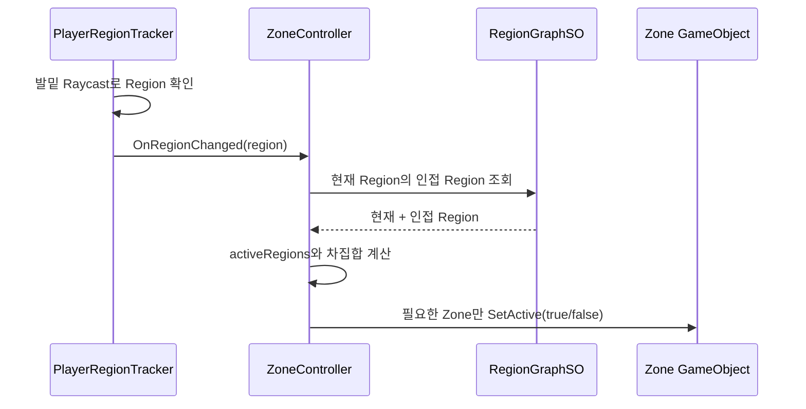

# 플레이 흐름을 답답하게 만들지 않기 위한 Zone 활성화

## 출발점은 렌더링 기술이 아니라 플레이 경험이었습니다

이 게임은 상자와 몬스터를 파밍하고, 금지구역을 피해 탈출 지점까지 살아가는 흐름이 중요합니다. 그런데 넓은 맵 에셋과 몬스터·상자 같은 런타임 오브젝트가 전부 계속 활성 상태로 남으면, 시간이 지날수록 불필요한 Update와 메모리 사용이 쌓여 플레이를 답답하게 만들 수 있다고 봤습니다.

그래서 이 시스템은 렌더러가 화면 밖을 그리지 않게 하는 프러스텀 컬링이 아닙니다. 현재 플레이에 필요한 지역만 **GameObject 단위로 활성 상태에 두는 런타임 관리**입니다.

## 현재 지역과 다음에 갈 수 있는 지역만 남겼습니다

`PlayerRegionTracker`는 플레이어 발밑에서 아래 방향으로 Raycast해 바닥의 `RegionSurface`를 찾습니다. Region이 바뀌면 이벤트를 보내고, `ZoneController`는 `RegionGraphSO`에서 현재 지역과 인접 지역을 조회합니다.

이전 활성 집합과 다음 활성 집합을 `HashSet`으로 비교해 새로 필요한 Zone만 켜고, 멀어진 Zone만 끕니다. Zone 아래에는 맵 에셋뿐 아니라 몬스터와 상자 생성 루트도 있으므로, 지역 하나를 `SetActive(false)`로 전환하면 해당 지역의 런타임 활성 범위도 함께 줄어듭니다.

```mermaid
sequenceDiagram
    participant Player as PlayerRegionTracker
    participant Controller as ZoneController
    participant Graph as RegionGraphSO
    participant Zone as Zone GameObject

    Player->>Player: 발밑 Raycast로 Region 확인
    Player->>Controller: OnRegionChanged(region)
    Controller->>Graph: 현재 Region의 인접 Region 조회
    Graph-->>Controller: 현재 + 인접 Region
    Controller->>Controller: activeRegions와 차집합 계산
    Controller->>Zone: 필요한 Zone만 SetActive(true/false)
```

## 확인한 변화와 남은 한계

개발 환경의 동일 게임 씬에서 모든 Zone을 활성화한 상태와 비교했을 때, Update CPU 측정값은 약 **4.75ms에서 2.75ms**로 줄었습니다. 이 수치는 모든 환경에 일반화한 결과가 아니라, 이 장면에서 전체 활성화와 부분 활성화를 비교한 값입니다. 실제 플레이에서도 전체가 활성화된 상태보다 끊김이 줄어드는 것을 확인했습니다.

Region 변경 이벤트와 Zone 상태 API는 이후 금지구역 기능을 붙이는 기반으로도 활용됐습니다. 다만 RegionGraph의 인접 관계를 사람이 직접 ScriptableObject에 입력해야 했습니다. 다음에는 맵 데이터에서 그래프를 자동 생성하거나, 연결 누락을 검증하는 편집 도구를 만들고 싶습니다.

## 코드에서 확인할 수 있는 지점

- `PlayerRegionTracker.TryGetGroundRegion`: 발밑 Raycast로 현재 Region 확인
- `PlayerRegionTracker.OnRegionChanged`: Region 전환 알림
- `ZoneController.GetRegionsToActivate`: 현재 Region과 인접 Region 계산
- `ZoneController.UpdateZones`: 이전/다음 활성 집합의 차이만 토글
- `ZoneController.activeRegions`: 현재 유지 중인 Region 집합
- `Zone`: 지역별 몬스터와 상자 스폰, Zone 상태 보유
