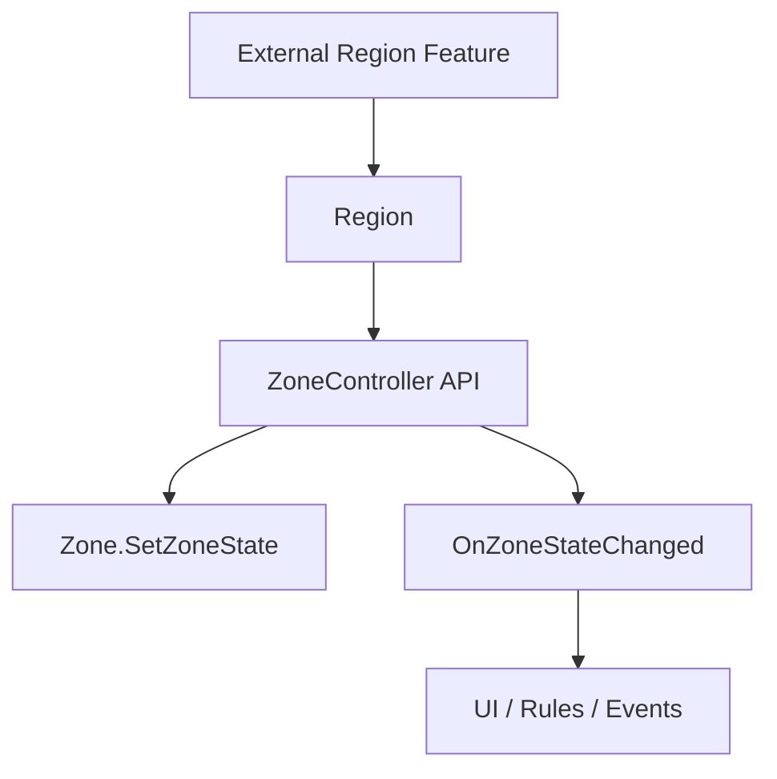

# Zone State API / Collaboration Extension

## Problem

금지구역, 하이퍼루프, 지역 이벤트 같은 기능은 모두 지역 정보를 사용하지만, 이 기능들이 `Zone` 내부 오브젝트나 스폰 구현을 직접 조작하면 협업 중 변경 비용이 커집니다.

이 프로젝트에서 제가 담당한 범위는 금지구역이나 하이퍼루프 자체 구현이 아니라, 그런 지역 기반 기능들이 붙을 수 있는 `Region`, `Zone`, `ZoneController` 중심의 구조였습니다.

## Solution

`ZoneController`가 `SetZoneState`, `SetZonesState`, `OnZoneStateChanged`를 제공해 외부 시스템이 Zone 내부 구현을 몰라도 지역 상태를 바꾸거나 구독할 수 있게 했습니다. 다른 팀원이 구현한 금지구역/이동/이벤트 기능은 이 API 위에서 연결될 수 있습니다.

## Flow

## Pattern / Stack

- Facade: 외부 기능은 `ZoneController` API만 호출
- Observer: 상태 변경 이벤트로 UI/룰/이벤트 시스템 확장 가능
- Open/Closed Principle: Zone 내부 구현을 바꾸지 않고 지역 기반 기능 추가 가능

## Code Points

- `ZoneController.SetZoneState`: 단일 지역 상태 변경
- `ZoneController.SetZonesState`: 여러 지역 상태 일괄 변경
- `ZoneController.OnZoneStateChanged`: 상태 변경 이벤트
- `Zone.SetZoneState`: Zone 내부 상태 갱신

## Portfolio Point

여기서 강조할 점은 “금지구역을 구현했다”가 아니라, 금지구역 같은 협업 기능이 Zone 시스템에 안전하게 연결될 수 있도록 API 경계를 만들었다는 점입니다.
